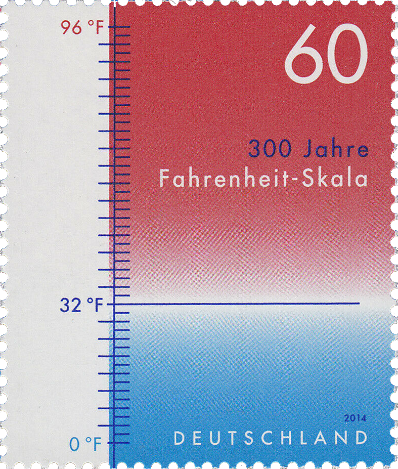

## Gegeven
In Europa gebruikt men voornamelijk de Celsius temperatuurschaal. Deze werd ca. 1742 door de Zweed <a href="https://nl.wikipedia.org/wiki/Anders_Celsius" target="_blank">Anders Celsius</a> geïntroduceerd. Wat vroeger, in 1724, introduceerde de Duitse natuurkundige <a href="https://nl.wikipedia.org/wiki/Gabriel_Fahrenheit" target="_blank">Gabriel Fahrenheit</a> zijn eigen temperatuurschaal. Deze wordt in verschillende landen (waaronder de Verenigde Staten) nog steeds gebruikt.

{:data-caption="De Fahrenheit schaal." width="25%"}

Om een temperatuur in graden Celsius $$\mathsf{T_C}$$ naar graden Fahrenheit $$\mathsf{T_F}$$ om te rekenen kan men onderstaande formule gebruiken:

$$
    \mathsf{T_F = \dfrac{9}{5} T_C + 32}
$$

## Gevraagd
Schrijf een programma dat een temperatuur in graden **Celsius** vraagt en vervolgens deze in graden **Fahrenheit** uitrekent. Rond het resultaat af op 2 cijfers na de komma.

#### Voorbeelden
Een temperatuur van 0,0°C komt overeen met 32,0°F.
```
temperatuur: 32.0 °F
```

Een temperatuur van 16,939°C komt overeen met 62,49°F.
```
temperatuur: 62.49 °F
```