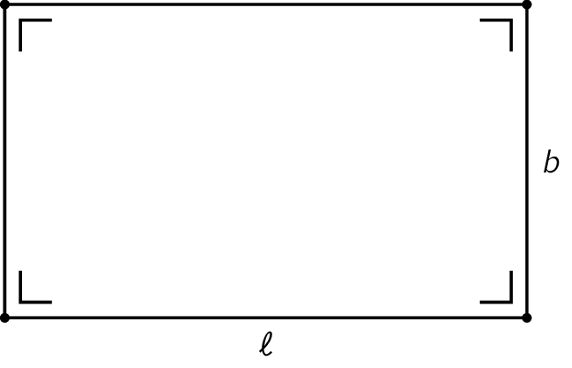

## Gegeven

Een rechthoek is per definitie een vierhoek met vier rechte hoeken. Deze heeft een lengte en breedte.

{:data-caption="Een rechthoek" .light-only width="30%"}

{:data-caption="Een rechthoek" .dark-only width="30%"}


## Gevraagd

* Schrijf een programma dat **vraagt** naar de lengte en breedte van een rechthoek;
* Bereken de **oppervlakte** van de rechthoek;
* Bereken de **omtrek** van de rechthoek;
* Geef de oppervlakte en omtrek van de rechthoek weer op het scherm.

#### Voorbeeld

Voor een rechthoek met lengte `10.75`en breedte `5.66` verschijnt er:

```
De oppervlakte van de rechthoek is 60.845 m².
De omtrek van de rechthoek is 32.82 m.
```

{: .callout.callout-info}
>#### Tips
>* Vergeet niet om de input om te zetten naar een `float` of `int`;
>* Wanneer je wil **concateneren**, kan je gebruik maken van een komma `,` of een plus `+`;
>* Een `,` zal automatisch een spatie invoeren, terwijl een `+` dat niet zal doen. 
