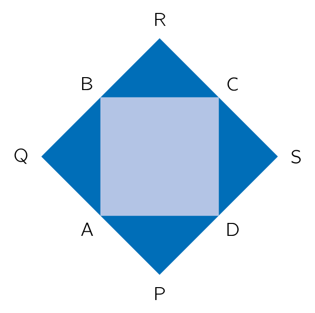

## Gegeven
Een probleem uit de oudheid was het verdubbelen van een vierkant. 
Hier zie je dat de **oppervlakte** van **vierkant PQRS** het **dubbel** is van **vierkant ABCD.**

{:data-caption="Vierkanten uit de oudheid." .light-only width="25%"}

{:data-caption="Vierkanten uit de oudheid." .dark-only width="25%"}

## Gevraagd
- Vraag naar de zijde van het vierkant ABCD;
- Bereken de `oppervlakte` van vierkant PQRS, dat het dubbel is van vierkant ABCD;
- Bereken de `lengte` van een zijde van vierkant PQRS;
- Rond de berekende `oppervlakte` en `lengte` af tot twee decimalen;
- Print de berekende `oppervlakte` en `zijde` van vierkant PQRS op het scherm in verzorgde volzinnen.

#### Voorbeeld

Als de lengte van een zijde van ABCD `15.763` m meet, dan verschijnt er:

```
De oppervlakte van vierkant PQRS is 496.94 m².
De lengte van een zijde van vierkant PQRS is 22.29 m.
```

{: .callout.callout-info}
>#### Tips
> - Vergeet niet om de input om te zetten naar een `float` of `int`.
> - Bereken de `lengte` van een zijde van vierkant PQRS door de formule voor de oppervlakte om te vormen.
