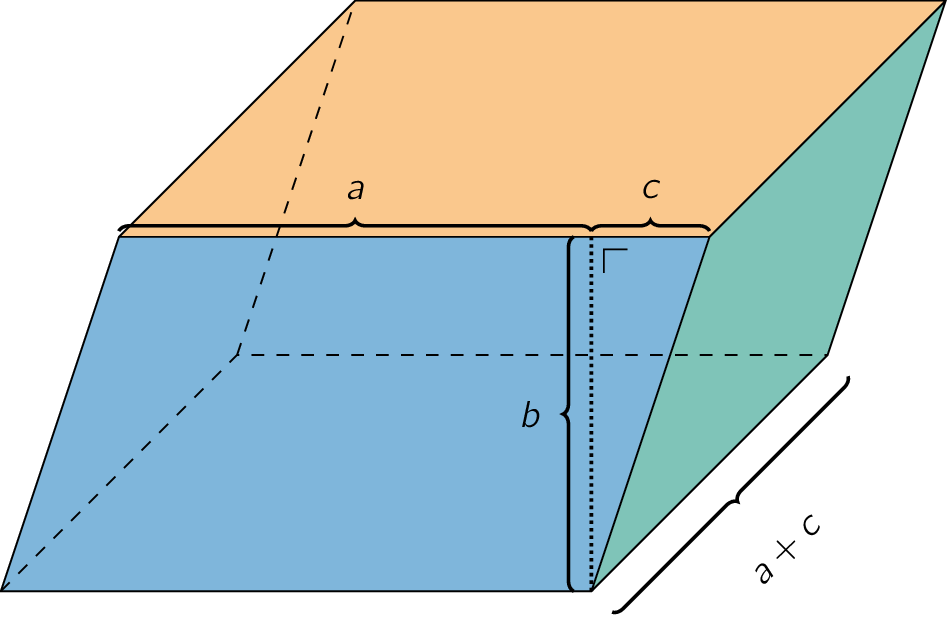
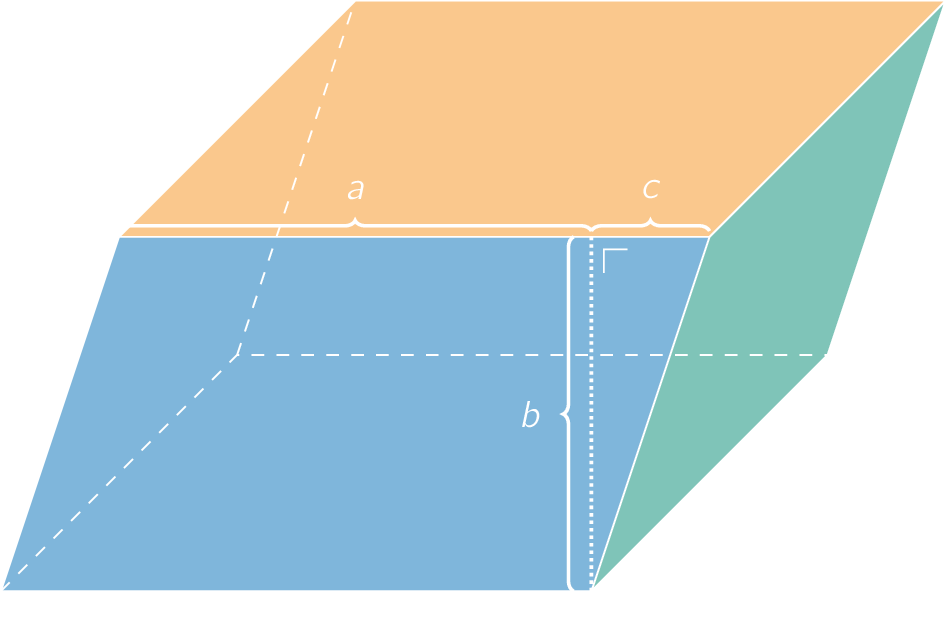

## Gegeven
Een parallellepipedum (probeer dat maar eens driemaal na elkaar uit te spreken) is een ruimtefiguur waarvan elk zijvlak opgebouwd is uit een parallellogram. 

In onderstaande figuur vormt het grondvlak een vierkant en krijg je drie afmetingen: a, b en c.

{:data-caption="Een parallellepipedum." .light-only width="45%"}

{:data-caption="Een parallellepipedum." .dark-only width="45%"}


## Gevraagd
* Schrijf een programma dat vraagt naar de lengte van a, b en c; 
* Bereken de **oppervlakte van het voorvlak** (het blauwe vlak), **rond af** naar twee decimalen en print dit naar het scherm; 
* Bereken de **omtrek van het voorvlak**, **rond af** naar twee decimalen en print dit naar het scherm; 
* Bereken het **volume van de volledige figuur**, **rond af** naar twee decimalen en print dit naar het scherm.


#### Voorbeeld
Indien `a`, `b` en `c` in volgorde `6.8`, `10.8` en `2.54` cm meten, dan verschijnt er:

```
De oppervlakte van het voorvlak bedraagt 100.87 cm².
De omtrek van het voorvlak bedraagt 40.87 cm.
Het volume van het parallellepipedum bedraagt 942.14 cm³.
```

{: .callout.callout-info}
>#### Tips
> * Start jouw algoritme met een `import math`.
> * Je zal de **stelling van Pythagoras** moeten gebruiken.  
> * De formule voor dit volume is dezelfde als deze voor een balk. 


