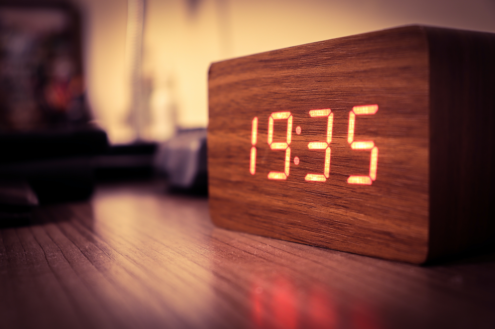

{:data-caption="Een digitale klok." width="40%"}

## Opgave
Schrijf een programma dat een aantal seconden (sinds middernacht) vraagt en vervolgens het aantal uren, minuten en seconden berekent. De weergave wordt zoals deze op een digitale klok.

#### Voorbeelden
Een invoer van `3912` seconden leidt tot:
```
1:5:12
```

En bij `12579` seconden verschijnt er:

```
3:29:39
```


{: .callout.callout-info}
>#### Tip
> Gebruik de functie `str( 11 )` om het getal `11` om te vormen naar tekst zodat je kunt concateneren met `+`.

