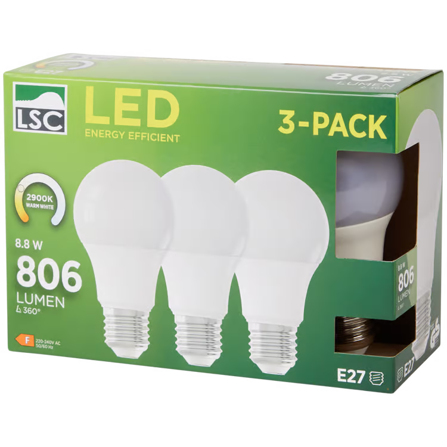

## Gegeven

Indien je een lamp wil aankopen zal je twee belangrijke cijfers terugvinden. Het vermogen uitgedrukt in watt (symbool W) en de lichtstroom (denk aan helderheid) uitgedrukt in lumen (symbool lm).

{:data-caption="Drie E27 lampen." width="40%"}

Eén van bovenstaande lampen heeft bijvoorbeeld een vermogen van 8,8 W. (dit bepaalt de hoeveelheid stroom die verbruikt wordt) De lamp kan 806 lumen produceren. Men kan dan gemakkelijk berekenen dat deze lamp een **lichtrendement** van **91,59 lumen per watt** heeft.

## Gevraagd

- Vraag aan de gebruik **in volgorde** naar het **vermogen** en de **lichtstroom**;
- Bereken het **lichtrendement** en geef dit op het scherm weer, **afgerond** op 2 decimalen.

#### Voorbeelden

Voor bovenstaande lampen van `8.8` W en `806` lumen verschijnt:
```
Het lichtrendement is 91.59 lumen per watt.
```

Bij een LED-lamp van `5.5` W en `470` lumen verschijnt:
```
Het lichtrendement is 85.45 lumen per watt.
```
