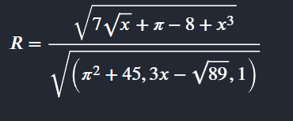

## Gegeven: 
In het laboratorium **CHEMLAB** bestuderen onderzoekers hoe snel een nieuwe chemische sensor reageert op verschillende concentraties van een teststof.

De snelheid van de sensor wordt niet rechtstreeks gemeten, maar berekend via een **complexe formule** die afhangt van de concentratie **x** (uitgedrukt in **mg/L**).

De formule voor de reactie-index **R** van de sensor is:

### Formule voor de reactie-index \(R\)

R=√( (7√x+ π-(8-x³)) / (π^2+45,3x-√89,1 ) )


of: 


{:data-caption="Formule reactie-index R." width="650px"}


Omdat deze berekening tijdrovend is, wil het labo een klein Python-programma laten schrijven dat dit automatisch uitvoert.

## Gevraagd:
Schrijf een programma dat:

- de concentratie **x** inleest (in mg/L);
- de waarde van **R** berekent volgens de formule;
  - Tip: splits de breuk op in twee variabelen **teller** en **noemer**.
- **R afrondt op 4 decimalen**;
- afdrukt tussen welke twee **opeenvolgende gehele getallen** de waarde van **R** ligt.

Gebruik deze uitvoervorm:
```
ondergrens < R < bovengrens
```

waarbij `ondergrens` en `bovengrens` opeenvolgende gehele getallen zijn.


## Voorbeeld

Voor invoer:
```text
7
```

Verschijnt er: 
```text
1 < 1.0598 < 2
```
