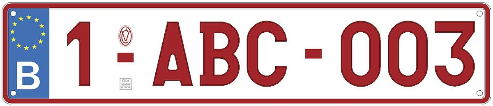

## Gegeven

De Belgische kentekens, of nummerplaten, bestaan uit een robijnrode combinatie op een witte achtergrond.

De combinatie kan bestaan uit letters, cijfers en streepjes. Sinds de invoering van de Europese nummerplaat in 2010 hebben de kentekens onderstaand formaat.

{:data-caption="Een Belgisch kenteken." width="40%"}

Zoals je merkt bestaat dit voorlopig uit een **indexcijfer** gevolgd door een lettercombinatie van **drie tekens** en daarna gevolgd door een getal van **drie cijfers**.

## Gevraagd

- Vraag aan een gebruiker eerst welk merk van wagen hij of zij heeft;
- Vraag daarna opeenvolgend naar het indexcijfer, de lettercombinatie en het eindgetal;
- Geef al deze informatie op een zorgvuldige manier weer op het scherm.

#### Voorbeeld

Bij de invoer:
```
Voer het merk van je wagen in: Volvo
Voer het indexcijfer in: 1
Voer de lettercombinatie van drie tekens in: ABC
Voer het slot getal van drie cijfers in: 003
```

verschijnt er:
```
De nummerplaat 1-ABC-003 is toegekend aan een Volvo.
```

{: .callout.callout-info}
>#### Tip
> Denk goed na over de invoer. In welk datatype moet dit staan? 
> Is het **nuttig** om invoer als een getal te beschouwen? (ga je er zinvol mee rekenen)
