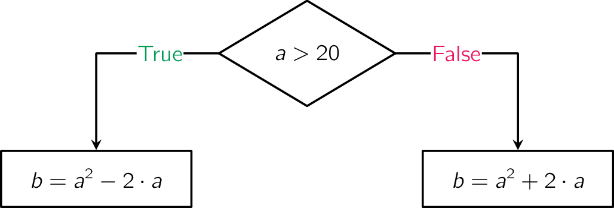
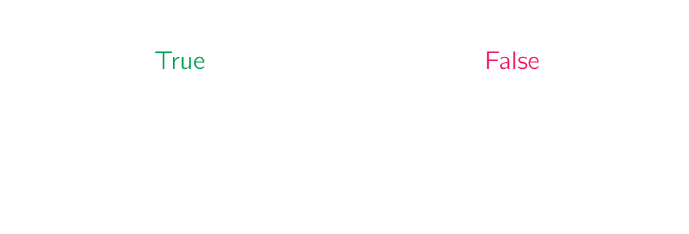

## Gegeven
Een getal $$\mathsf{a}$$ wordt ingelezen en doorloopt een volledige beslissingsboom. 

{:data-caption="Stroomdiagram." .light-only width="40%"}

{:data-caption="Stroomdiagram." .dark-only width="40%"}

## Gevraagd
* Lees een **geheel getal** $$\mathsf{a}$$ in.
* Bepaal $$\mathsf{b}$$ overeenkomstig het stroomdiagram.
* Toon tot slot het getal $$\mathsf{b}$$.

#### Voorbeeld
```
Voer een getal a in: 25
```
Leidt tot de uitvoer:
```
Het berekende getal b is: 575
```