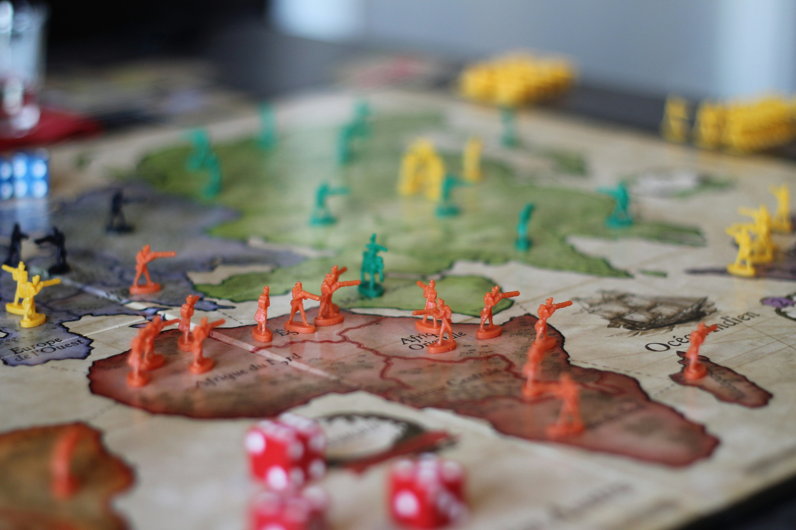

## Gegeven

<a href="https://nl.wikipedia.org/wiki/Risk_(bordspel)">Risk</a> is een klassiek bordspel waarbij het (meestal) de bedoeling is dat je de ganse wereldkaart gaat veroveren. Elk gebied dat je bezet geeft je per beurt een aantal legers die je kan gebruiken om een tegenstander aan te vallen.

{:data-caption="Een spelletje Risk." width="40%"}

Bij het aanvallen is het steeds zo dat de aanvaller met drie dobbelstenen gooit en de verdediger met slechts twee dobbelstenen mag gooien. Daarna worden de ogen gerangschikt van hoog naar laag, en de twee hoogste dobbelstenen van de aanvaller worden vergeleken met de twee dobbelstenen van de verdediger.

De vergelijking gebeurt als volgt:

* Voor elk paar van dobbelstenen (hoogste tegen hoogste, tweede hoogste tegen tweede hoogste):
* Als de dobbelsteen van de aanvaller **strikt hoger is dan die van de verdediger**, verliest de verdediger één legereenheid.
* In **alle andere gevallen** (dus als de dobbelstenen gelijk zijn of de aanvaller lager gooit), verliest de aanvaller één legereenheid.

Een eerste voorbeeld ter verduidelijking: 

Als de **aanvaller** de volgende dobbelstenen gooit:

 <span class="mdi mdi-36px mdi-dice-2-outline"></span> <span class="mdi mdi-36px mdi-dice-5-outline"></span> <span class="mdi mdi-36px mdi-dice-1-outline"></span>
 
en de **verdediger** gooit op zijn beurt:

 <span class="mdi mdi-36px mdi-dice-4-outline"></span> <span class="mdi mdi-36px mdi-dice-3-outline"></span>

In dit geval verliezen beide legers een eenheid. We leggen dit als volgt uit: 
* De 5 van de aanvaller wint immers van de 4 van de verdediging.
* Maar de volgende hoogste waarde van de aanvaller, namelijk een 2, verliest van de volgende hoogste waarde van de verdediging, namelijk een 3.

Een nieuw voorbeeld waarin een **gelijkspel** voorkomt:

Als de aanvaller de volgende dobbelstenen gooit:

 <span class="mdi mdi-36px mdi-dice-5-outline"></span> <span class="mdi mdi-36px mdi-dice-3-outline"></span> <span class="mdi mdi-36px mdi-dice-2-outline"></span>

en de verdediger gooit op zijn beurt:

 <span class="mdi mdi-36px mdi-dice-5-outline"></span> <span class="mdi mdi-36px mdi-dice-4-outline"></span>

In dit geval verliest de aanvaller twee legereenheden. Hier is wat er gebeurt:
* De hoogste worp van aanvaller en verdediger is bij beiden een vijf.
* Omdat de waarden gelijk zijn, en dus niet **strikt hoger**, wint de verdediger bij deze worp en verliest de aanvaller een eenheid.
* De tweede hoogte worp van de aanvaller is een 3. Van de verdediger een 4.
* De aanvaller verliest nog een legereenheid. 


## Gevraagd

Schrijf een programma waarbij de aanvaller de eerste drie worpen dient in te geven en daarna de verdediging de volgende twee worpen intikt. Je programma geeft vervolgens weer hoeveel legereenheden elk verliest.

#### Voorbeeld 1

In het vorige voorbeeld tikt de aanvaller achtereenvolgend `2`, `5` en `1` in. De verdediger tikt `4` en `3` in. Er verschijnt:

```
Verloren eenheden aanvaller: 1
Verloren eenheden verdediging: 1
```


#### Voorbeeld 2

Stel dat de **aanvaller** de volgende dobbelstenen gooit:

<span class="mdi mdi-36px mdi-dice-4-outline"></span> <span class="mdi mdi-36px mdi-dice-5-outline"></span> <span class="mdi mdi-36px mdi-dice-4-outline"></span>
 
en de **verdediger** gooit op zijn beurt:

 <span class="mdi mdi-36px mdi-dice-5-outline"></span> <span class="mdi mdi-36px mdi-dice-4-outline"></span>

dan verlies de aanvaller twee legereenheden! De grootste worpen moeten immers **meer** zijn dan die van de verdediging.

In dit geval tikt de aanvaller in `4`, `5` en `4` in. De verdediger tikt `5` en `4` in. Er verschijnt:

```
Verloren eenheden aanvaller: 2
Verloren eenheden verdediging: 0
```
