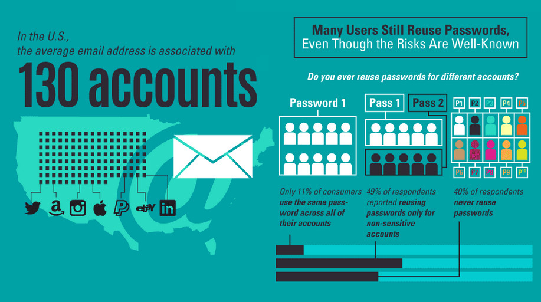

Volgens onderzoek van <a href="https://www.digitalguardian.com/blog/uncovering-password-habits-are-users-password-security-habits-improving-infographic" target="_blank">Digital Guardian</a> in 2020 is één emailadres gemiddeld gesproken met wel 130 verschillende accounts geassocieerd. Het is dus niet abnormaal dat je je gebruikersnaam soms eens vergeet.

{:data-caption="Aantal accounts per emailadres." width="400px"}

Indien je ook je wachtwoord vergeten bent, kan je meestal een nieuw wachtwoord laten instellen. Soms vraagt de website hierbij naar je emailadres **en** gebruikersnaam.

## Gevraagd
Schrijf een programma dat vraagt naar het emailadres **en** de gebruikersnaam en vervolgens controleert of dit overeenkomt met de gegevens van gebruiker `janedoe`.

Print een van de volgende berichten af:
- 'Emailadres niet gekend.' als het `emailadres` foutief is;
- 'Gebruiker en email komen niet overeen.' als het `emailadres` niet correspondeert met de `gebruikersnaam`;
- 'Resetlink verstuurd.' als het `emailadres` **en** de `gebruikersnaam` overeenkomen.

#### Voorbeeld
```
Voer uw emailadres in: janedoe@sintlievenscolege.be
Voer uw gebruikersnaam in: janedoe
```

leidt tot de uitvoer:
```
Emailadres niet gekend.
```
