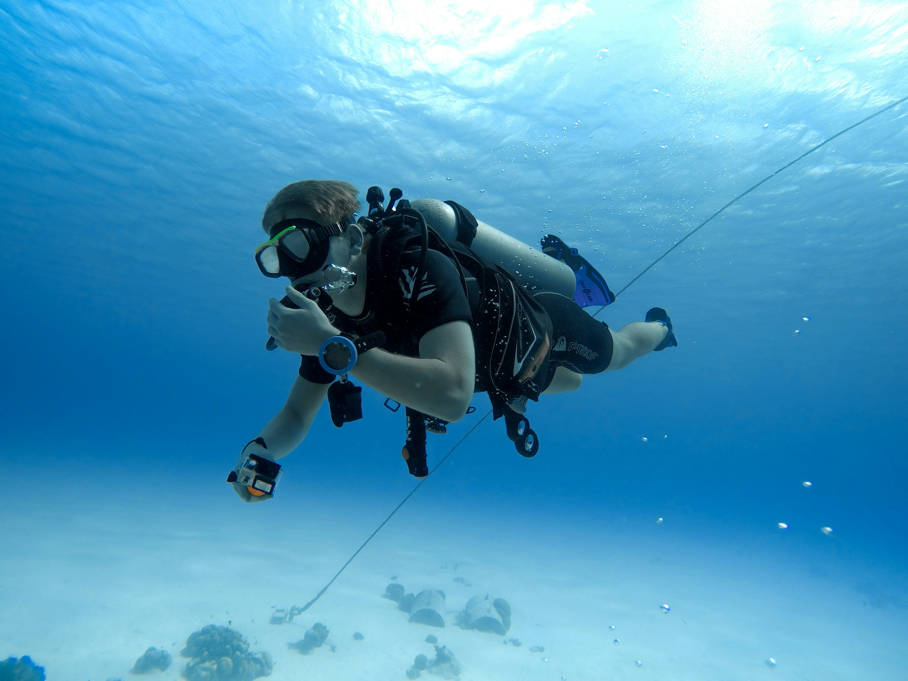

## Gegeven
Wanneer je aan diepteduiken doet, moet je opletten bij het terugkeren naar de oppervlakte. Ga je te snel, dan verandert de druk zo snel dat je gevaar loopt. De duiker gaat bij het stijgen van een omgeving met hogere druk naar een omgeving met lagere druk. Daarom moet je op bepaalde punten even stoppen. De duiker doet hier dus aan **decompressie**. Dat betekent letterlijk *"ontdrukken"*. 

*	Als je minder dan 30 minuten duikt moet je niet stoppen op 3 meter.
*	Als je minder dan 40 minuten duikt moet je 5 minuten stoppen op 3 meter.
*	Als je minder dan 50 minuten duikt moet je 10 minuten stoppen op 3 meter.
*	Als je minstens 50 minuten duikt moet je 12 minuten stoppen op 3 meter.


{:data-caption="Een duiker in Bonaire, Carabisch Nederland." width="40%"}

## Gevraagd

Schrijf een programma voor een eenvoudige duikcomputer. Vraag naar de **tijdsduur** van de duik op 18 meter diepte en geef daarna weer hoe lang en op welke diepte de duiker moet pauzeren wanneer deze aan **decompressie** doet. 

#### Voorbeelden
Indien de gebruiker `42` minuten intikt, dan verschijnt er:

```
Je moet tien minuten stoppen op 3 meter. 
```


Indien de gebruiker `29` minuten intikt, dan verschijnt er:

```
Je hoeft niet te stoppen op 3 meter.
```
