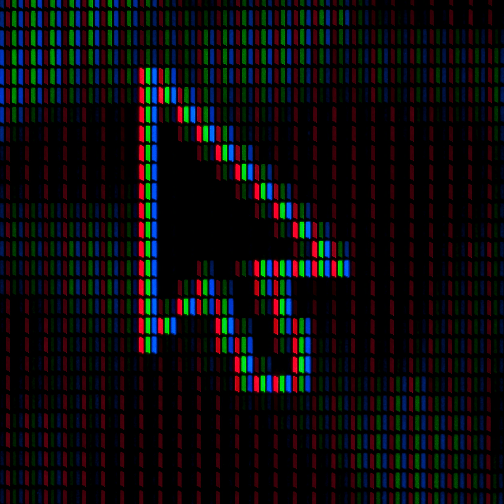

## Gegeven

De meeste computerschermen bestaan uit een hoeveelheid pixels. Deze zijn opgebouwd uit subpixels, meestal is er een **rode**, een **groene** en een **blauwe** subpixel (RGB). Deze **drie** subpixels vormen dus samen één pixel. 

{:data-caption="Een muisaanwijzer opgebouwd uit pixels." width="35%"}

## Gevraagd

* Een beeldscherm passeert na assemblage vaak door een kwaliteitskeuring. 
* Een computer telt vervolgens het `aantal subpixels`.
* Indien dit niet deelbaar is door 3, dan bevat het scherm minstens één **dode** pixel en is het dus defect.
* Vraag naar het `aantal subpixels` en controleer of dit aantal deelbaar is door drie.
* Geef een passende boodschap mee op het scherm. 

#### Voorbeelden
Indien er `2082` subpixels geteld worden, dan verschijnt de volgende boodschap:

```
Het scherm is waarschijnlijk ok.
```

Indien er `2048` subpixels geteld worden, dan verschijnt de volgende boodschap:

```
Het scherm bevat zeker een defect!
```
