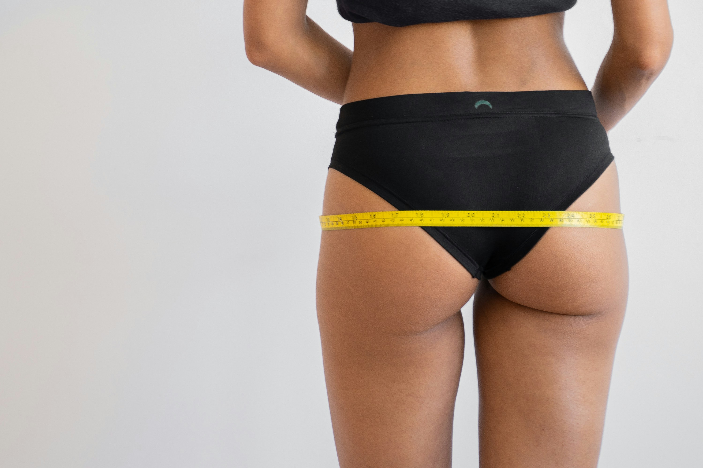

De <a href="https://nl.wikipedia.org/wiki/Wereldgezondheidsorganisatie" target="_blank">Wereldgezondheidsorganisatie (WHO)</a> gebruikt steeds vaker de taille-heup verhouding als indicator van het risico op hartziekte. 

De formule hiervoor is: 
```
p = taille / heup
```

{:data-caption="De heup omtrek bepalen." width="40%"}


In onderstaande tabel zie je de risico's uitgedrukt voor blanke volwassenen.

|                       | Mannen        |   Vrouwen     |
|:----------------------|:-------------:|:-------------:|
| Laag risico           | < 0,94        | < 0,80        |
| Verhoogd risico       | 0,94 tot 1,00 | 0,80 tot 0,90 |
| Sterk verhoogd risico | > 1,00        | > 0,90        |
{:class="table table-striped table-condensed" style="width:auto;margin-left:auto;margin-right:auto;"}

## Opgave
* Schrijf een programma dat het biologische geslacht van de gebruiker vraagt.
* De gebruiker antwoordt hierop met `"man"` of `"vrouw"`.
* Daarna vraagt je programma in volgorde naar de omtrek van de taille en de heup.
* Tot slot geeft het programma de taille-heupverhouding en de categorie weer.
* **Rond** hierbij **af** op twee decimalen.

#### Voorbeelden
Voor een man met een tailleomtrek van `95.1` cm en een heupomtrek van `98.2` verschijnt er:
```
Je taille-heup verhouding is: 0.97
Verhoogd risico op hart- en vaatziekten.
```
