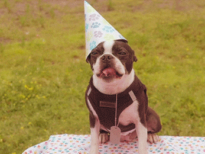

Hoe oud is je hond in vergelijkbare 'mensenjaren'? Op de website van de <a href="https://www.akc.org/expert-advice/health/how-to-calculate-dog-years-to-human-years/" target="_blank">American Kennel Club</a> leest men de volgende regel:

- Het eerste levensjaar van een hond telt meteen voor 15 mensenjaren;
- het tweede levensjaar telt voor 9 extra mensenjaren;
- elk volgend jaar telt voor 5 extra mensenjaren.

{:data-caption="Jarige hond." width="347px"}

## Opgave
Schrijf een programma dat de **leeftijd** van de hond vraagt en vervolgens het equivalente **aantal mensenjaren** afdrukt.

#### Voorbeelden
Voor een hond van één jaar verschijnt er:
```
Deze hond is ongeveer 15 mensenjaren oud.
```

Voor een hond van twee jaar verschijnt er:
```
Deze hond is ongeveer 24 mensenjaren oud.
```

Voor een hond van vier jaar verschijnt er:
```
Deze hond is ongeveer 34 mensenjaren oud.
```

