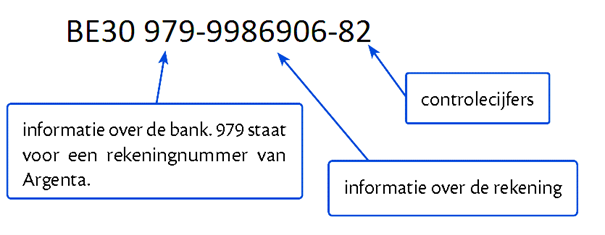

## Gegeven
Bij sommige nummers (zoals rekeningnummers) wordt een controlegetal gebruikt om fouten bij het invoeren te ontdekken. 
Het controlegetal wordt berekend met een wiskundige regel:

* Neem de eerste 10 cijfers van het rekeningnummer.
* De BE en de eerste twee cijfers – het controlegetal – tellen niet mee.
* Deel dit getal door 97 en bepaal de rest van de deling.
* Vergelijk deze rest met het controlegetal:
* Is de rest gelijk aan het controlegetal → het rekeningnummer is geldig
* Anders → het rekeningnummer is ongeldig


## Gevraagd
Controleer een rekeningnummer met een controlegetal. 
* Schrijf een programma dat de eerste tien cijfers vraagt. 
* Daarna vraag je naar het controlegetal. 
* Klopt het controlegetal? Dan is het nummer geldig.
* Anders is het nummer ongeldig. 

## Voorbeelden

#### Invoer
```
Eerste 10 cijfers: 1234567890
Controlegetal: 45

```
#### Uitvoer
```
Het controlegetal klopt niet. Het nummer is ongeldig.

```

