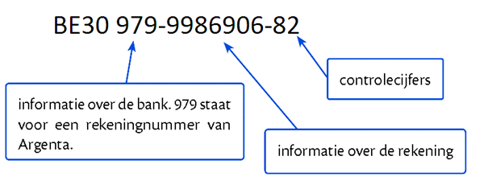

## Gegeven
Bij sommige nummers (zoals rekeningnummers) wordt een controlegetal gebruikt om fouten bij het invoeren te ontdekken. 
Het controlegetal wordt berekend met een wiskundige regel:

* Neem de **eerste 10 cijfers van het rekeningnummer** (zonder BE en zonder het controlegetal).
* Deel dit getal door **97** en bepaal de **rest van de deling.**
* **Speciale regel:**
*  Speciale Belgische regel: als de rest 0 is, wordt die behandeld als 97. Verander elke restwaarde van precies nul naar 97 (het controlegetal kan niet 0 zijn).
*  Vergelijk deze rest dan met het **controlegetal** (de laatste 2 cijfers van het rekeningnummer).


## Gevraagd
Controleer een rekeningnummer met een controlegetal. 
* Schrijf een programma dat de eerste tien cijfers vraagt. 
* Daarna vraag je naar het controlegetal. 
* Klopt het controlegetal? Dan is het nummer geldig.
* Anders is het nummer ongeldig. 

## Voorbeelden

#### Invoer
```
Eerste 10 cijfers: 1234567890
Controlegetal: 45

```
#### Uitvoer
```
Het controlegetal klopt niet. Het nummer is ongeldig.

```

