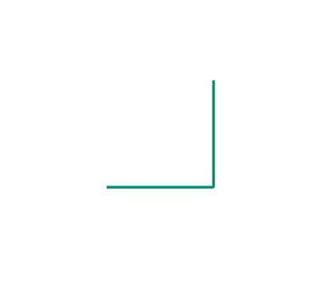
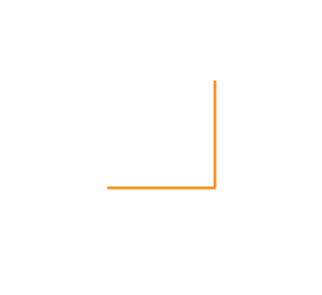

## Gegeven

De <a href="https://en.wikipedia.org/wiki/Dragon_curve" target="_blank">draakkromme</a> is een zeer interessante <a href="https://nl.wikipedia.org/wiki/Fractal" target = "_blank">fractaal</a> gevonden door de fysici John Heighway, Bruce Banks en William Harter terwijl ze werkten voor de NASA. De kromme speelt ook een belangrijke rol in het boek <a href="https://nl.wikipedia.org/wiki/Jurassic_Park_(boek)" target="_blank">Jurassic Park</a> van Michael Crichton.

De draakkromme ontstaat door elk lijnstuk op een specifieke manier in **twee te verdelen**. De lengtes van de lijnstukken worden bij **elke iteratie** kleiner door **deling** met $$\mathsf{\sqrt{2}}$$.

{:data-caption="Vorming van de draakkromme." .light-only width="354px"}

{:data-caption="Vorming van de draakkromme." .dark-only width="354px"}

## Gevraagd
Schrijf een programma dat:
* de lengte van één zijde als invoer vraagt;
* het **aantal iteraties** als invoer vraagt;
* de lengtes van de draakkromme berekent en telkens print op het scherm, **afgerond** op 2 decimalen. 

#### Voorbeeld
Meet de zijde oorspronkelijk `1` cm en bereken je de lengte tot en met iteratie `5`, dan verschijnt er:
```
De startlengte was 1.0 cm.
In iteratie 1 is de lengte van de draakkromme 1.41 cm.
In iteratie 2 is de lengte van de draakkromme 2.0 cm.
In iteratie 3 is de lengte van de draakkromme 2.83 cm.
In iteratie 4 is de lengte van de draakkromme 4.0 cm.
In iteratie 5 is de lengte van de draakkromme 5.66 cm.

```

{: .callout.callout-info}
>#### Opmerking
> De waarden zijn berekend met de formule:
>
> ```
> Lengte iteratie n = Startlengte × (√2)^n
> ```
