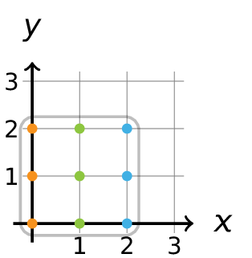
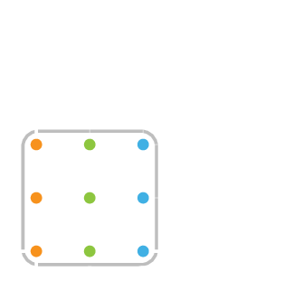

Als je een vierkant in een orthornormaal assenstelsel beschouwt, dan liggen enkele gehele coördinatenkoppels **binnen** dit vierkant. In het onderstaande geval liggen er 9 gehele coördinatenkoppels binnen het vierkant met zijde 3.

{:data-caption="Gehele coördinatenkoppels binnen een vierkant." .light-only width="250px"}

{:data-caption="Gehele coördinatenkoppels binnen een vierkant." .dark-only width="250px"}

## Gevraagd
Schrijf een programma dat de zijde van een vierkant vraagt en daarna alle coördinatenkoppels binnen het vierkant met deze zijde op het scherm weergeeft.

Werk hierbij van links naar rechts en van onder naar boven.

#### Voorbeeld

Voor een invoer van `3` verschijnt er dus:
```
Een vierkant met een zijde van 3 bevat deze punten:
( 0 , 0 )
( 0 , 1 )
( 0 , 2 )
( 1 , 0 )
( 1 , 1 )
( 1 , 2 )
( 2 , 0 )
( 2 , 1 )
( 2 , 2 )
```

{: .callout.callout-info}
>#### Tip 
> Gebruik een geneste herhaling
