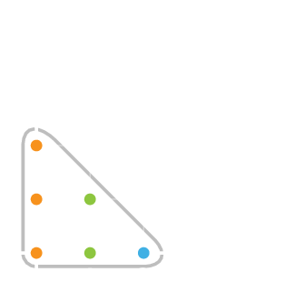

Als je een gelijkbenig en rechthoekige driehoek in een orthornormaal assenstelsel tekent, dan liggen enkele gehele coördinatenkoppels **binnen** deze driehoek. In het onderstaande geval liggen er 6 gehele coördinatenkoppels binnen deze driehoek met 3 punten op de rechthoekszijden.

{:data-caption="Gehele coördinatenkoppels binnen een driehoek." .light-only width="250px"}

{:data-caption="Gehele coördinatenkoppels binnen een driehoek." .dark-only width="250px"}

## Gevraagd
Schrijf een programma dat het aantal punten op de rechthoekszijde van de gelijkbenige, rechthoekige driehoek vraagt en daarna alle coördinatenkoppels binnen deze driehoek met deze rechthoekszijde op het scherm weergeeft.

Werk hierbij van links naar rechts en van onder naar boven.

#### Voorbeeld

Voor een invoer van `3` verschijnt er dus:
```
Een gelijkbenige rechthoekige driehoek met 3 punten op de benen, bevat deze punten:
( 0 , 0 )
( 0 , 1 )
( 0 , 2 )
( 1 , 0 )
( 1 , 1 )
( 2 , 0 )
```

{: .callout.callout-info}
>#### Tip 
> Gebruik een **geneste** herhaling.
