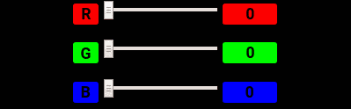

## Gegeven
Het RGB-kleursysteem is een manier om een kleur uit te drukken met behulp van een combinatie van de drie primaire kleuren Rood-Groen-Blauw. De hoeveelheid van een kleur ligt in tussen 0 (niets van die kleur) en het 255 (alles van die kleur). 

Er geldt bijvoorbeeld dat `[227, 33, 25]` staat voor 227 rood, 33 groen en 25 blauw, wat resulteert in <span style="color:rgb(227,33,25)">**deze kleur**</span>.

{:data-caption="RGB waarden." width="350px"}

## Gevraagd

Schrijf volgend programma dat voor een gegeven RGB **lijst** de drie waarden apart weergeeft.

#### Voorbeeld
Indien de gebruiker `227 33 25` ingeeft, dan verschijnt er:

```
Rood: 227
Groen: 33
Blauw: 25
```

{: .callout.callout-info}
>#### Tips
> * De gegeven code `list(map(int, invoer.split()))` vormt de **string** `227 33 25` om naar een **lijst** `[227 33 25]`;
> * Je hoeft in deze oefening **geen** herhaling te implementeren, deze oefening werkt enkel met lijsten.