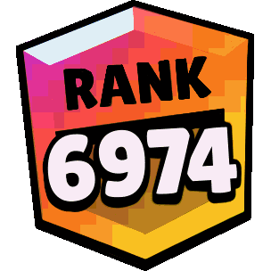

## Gegeven

Bij het ontwikkelen van een online twee spelers computerspel werkt men een *ranking* systeem uit. Telkens je drie wedstrijd wint stijg je een *rank*. Verlies je daarentegen drie wedstrijden dan zak je een *rank*. De gewonnen wedstrijden hoeven niet opeenvolgend te zijn. 

{:data-caption="Een hoge rank werd behaald." width="200px"}

Telkens er er drie gewonnen (of verloren) wedstrijden gedetecteerd werden, moet de ranking (indien nodig) aangepast worden. Een speler kan geen ranking onder 0 hebben.

## Gevraagd

Schrijf een programma dat vraagt naar de wingeschiedenis van de speler, deze wordt ingegeven als één opeenvolgende string die bestaat uit de letters `"W"` van **win** en `"L"` van **lose**. Bepaal aan de hand van deze string de ranking van de speler. 

##### Voorbeelden

Indien de speler intikt: `"WWLW"` verschijnt er:

```
rank: 1
```
Er werden eerst twee wedstrijden gewonnen, daarna ééntje verloren, de derde gewonnen wedstrijd zorgde er echter voor dat de rank met één steeg.

Indien de speler intikt: `"WWWWWLWW"` verschijnt er:

```
rank: 2
```

Tikt de speler in: `"LLLLLLWWLWW"` verschijnt er:

```
rank: 1
```

Tikt de speler in: `"WWLWLLWLLL"` verschijnt er:

```
rank: 0
```