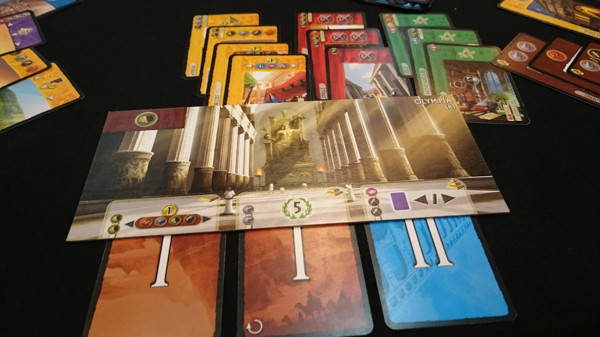

## Gegeven

<a href="https://nl.wikipedia.org/wiki/7_Wonders" target="_blank">7 Wonders</a> is een populair bordspel voor twee tot zeven spelers.

{:data-caption="Enkele 7 Wonders kaarten." width="45%"}

In het spel moet je onder andere gebouwen bouwen om punten te verdienen, op het einde wint diegene met de meeste punten. Eén van de winnende strategiën is om te focussen op de constructie van wetenschappelijke gebouwen. De wetenschappelijke bouwkaarten kunnen in drie gebieden vooruitgang bieden, elke kaart is voorzien van ofwel een tandwiel (`"T"`), een passer (`"P"`) en schrijftablet (`"S"`).

Voor elk type kaart verdient de speler een hoeveelheid punten gelijk aan het kwadraat van het aantal kaarten van dat type. Daarenboven krijgt de speler voor **elke** verzameling van de drie verschillende types 7 punten.

Bijvoorbeeld, indien een speler 3 schrijftabletkaarten, 2 passerkaarten en 1 tandwielkaart heeft, dan verdient deze speler 3² + 2² + 1² + 7 = 21 punten.

## Gevraagd
Omdat het op het einde van het spel omslachtig kan worden de punten manueel uit te rekenen is het aan jou een programma te schrijven dat deze puntentelling implementeert. Vraag aan de gebruiker één string met de letters `"T"`, `"P"` en `"S"`, wat telkens de wetenschappelijke kaarten die de speler gelegd heeft voorstellen. Uiteindelijk geef je de punten die deze wetenschappelijke kaarten opbrengen weer.

#### Voorbeelden

De kaarten `"STPSSP"` leveren het volgende aantal punten:
```
21
```

De kaarten `"PPP"` leveren het volgende aantal punten:
```
9
```

De kaarten `"TTPPSS"` leveren het volgende aantal punten:
```
26
```

{: .callout.callout-secondary}
>#### Bron
> 2e ProgNova Multi-University Programming Contest van 2016

