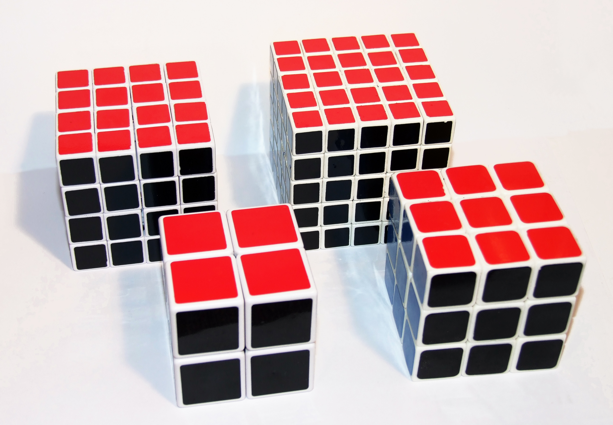

De <a href="https://nl.wikipedia.org/wiki/Rubiks_kubus" target="_blank">Rubiks kubus</a> bestaat in heel wat varianten, naast de standaard 3x3x3 uitvoering bestaan er ook 2x2x2, 4x4x4, enz...

{:data-caption="Vier uitvoeringen van de Rubiks kubus." width="40%"}

## Gevraagd
Schrijf een programma dat een getal `n` **vraagt** en daarna weergeeft hoeveel **vierkanten** de zijvlakken van elke kubus met zijde vanaf 2 tot en met `n` zijn opgebouwd.

#### Voorbeeld
Voor invoer `5` verschijnt er:
```
Een kubus met zijde 2 heeft 24 vierkanten.
Een kubus met zijde 3 heeft 54 vierkanten.
Een kubus met zijde 4 heeft 96 vierkanten.
Een kubus met zijde 5 heeft 150 vierkanten.
```
