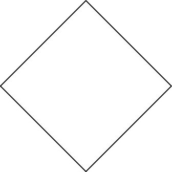

## Gegeven

Bij de onderstaande Griekse vierkanten wordt het vierkant gedraaid over 45° en de oppervlakte telkens **gehalveerd**. Er onstaat een fascinerende figuur.

{:data-caption="Vorming van de Griekse vierkanten." .light-only width="236px"}

{:data-caption="Vorming van de Griekse vierkanten." .dark-only width="236px"}


## Gevraagd

Vraag de gebruiker eerst naar het aantal iteraties dat uitgevoerd moet worden. Daarna vraag je de **oppervlakte** van het eerste vierkant. 

Vervolgens geef je van elk opeenvolgend vierkant de zijde en de oppervlakte weer. Rond af op twee decimalen.

#### Voorbeeld

Indien de gebruiker `4` iteraties vraagt en als startoppervlakte `144.0` ingaf, dan verschijnt er:

```
De startzijde meet 12.0 cm en de oppervlakte was 144.0 cm².
In iteratie 1 meet de zijde 8.49 cm en bedraagt de oppervlakte 72.0 cm².
In iteratie 2 meet de zijde 6.0 cm en bedraagt de oppervlakte 36.0 cm².
In iteratie 3 meet de zijde 4.24 cm en bedraagt de oppervlakte 18.0 cm².
In iteratie 4 meet de zijde 3.0 cm en bedraagt de oppervlakte 9.0 cm².
```
