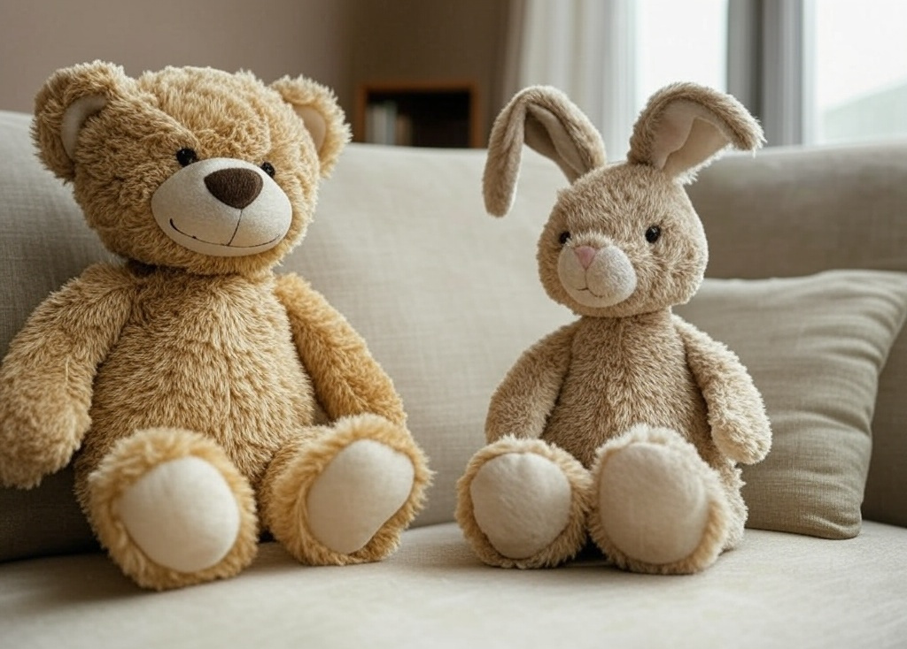

Het telrijmpje "2 knuffels" gaat als volgt:

> 2 knuffels zitten netjes op een rij<br>Eentje fluistert zachtjes: Mag ik er ook nog bij?
>
> 3 knuffels zitten netjes op een rij<br>Eentje fluistert zachtjes: Mag ik er ook nog bij?
>
> 4 knuffels zitten netjes op een rij<br>...

{:data-caption="2 knuffels, afbeelding door Grok AI." width="35%"}

## Gevraagd
Schrijf een programma dat naar het aantal strofes uit het telrijmpje vraagt en geef vervolgens evenveel strofes weer.

#### Voorbeeld

Indien de gebruiker `3` intikt, dan verschijnt er:

```
2 knuffels zitten netjes op een rij
Eentje fluistert zachtjes: Mag ik er ook nog bij?
3 knuffels zitten netjes op een rij
Eentje fluistert zachtjes: Mag ik er ook nog bij?
4 knuffels zitten netjes op een rij
Eentje fluistert zachtjes: Mag ik er ook nog bij?
```
