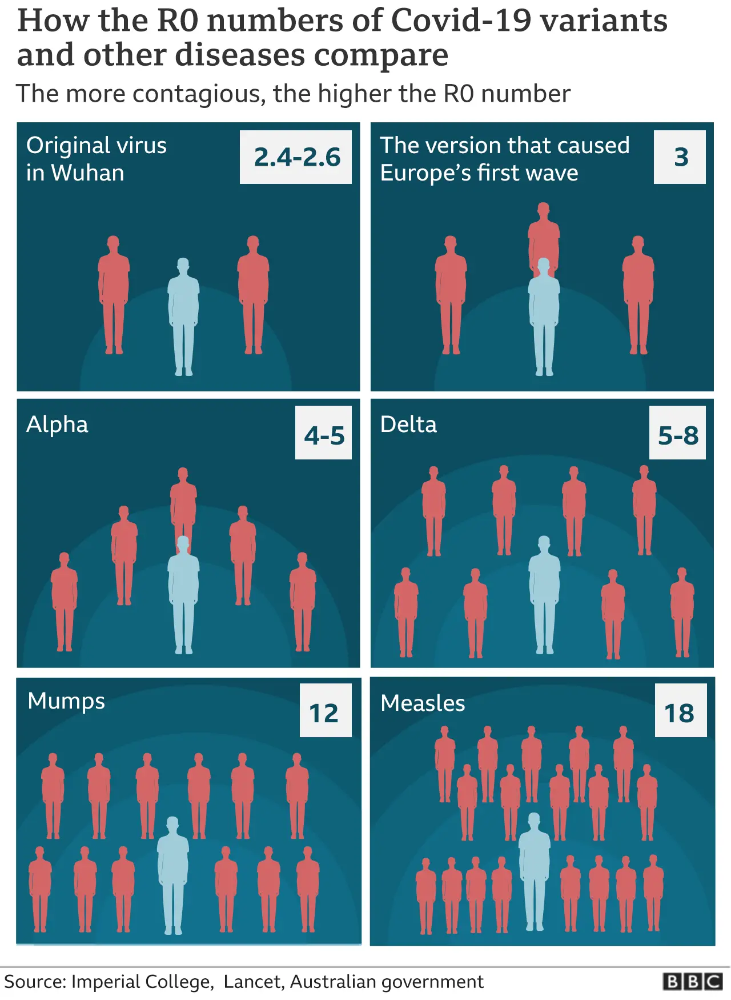

## Gegeven

Besmettelijke ziektes hebben een besmettingsgetal, genaamd R<sub>0</sub>. Dit geeft aan hoeveel personen een zieke persoon kan besmetten zonder maatregelen. Zo betekent een besmettingsgetal van 2 dat 1 zieke persoon 2 andere zal besmetten. Deze nieuwe besmettingen zullen op hun beurt 2 andere personen besmetten, enz... Bij een R<sub>0</sub> waarde van meer dan 1 groeit de epidemie, bij andere waarden neemt de epidemie af.

Op onderstaande infografiek van de BBC zie je de R<sub>0</sub> waarden voor de verschillende COVID varianten, mumps (bof) en measles (mazelen).

{:data-caption="Verschillende R<sub>0</sub> waarden, door de BBC." width="40%"}

## Gevraagd

Schrijf een programma dat de R<sub>0</sub> waarde aan de gebruiker vraagt. **Daarna** vraagt het programma naar een aantal besmettingen. Vervolgens wordt het totale aantal besmette personen per tijdseenheid of cyclus weergegeven. 

Indien het aantal besmette personen **minimaal** de collegepopulatie is (bij benadering 1200 leerlingen) dan stopt het programma.

#### Voorbeeld

Indien de R<sub>0</sub> `4.8` bedraagt en er reeds `20` besmette personen op school zijn, dan verschijnt er:

```
Na 1 cycli zijn er 116 besmettingen.
Na 2 cycli zijn er 672 besmettingen.
Na 3 cycli zijn er 3897 besmettingen.
```

Immers, na 1 cylcus komen er 96 personen bij de reeds 20 besmette personen, dan zijn er dus 116 besmette personen. In de volgende cyclus komen er 556 nieuwe besmettingen bij, enz...

{: .callout.callout-info}
>#### Tips
> - Bereken in elk stap het aantal nieuwe besmettingen. Doordat R<sub>0</sub> een kommagetal kan zijn, zal je dit moeten afronden, **rond** hierbij **af naar beneden**.
> - Je mag er in je programma van uitgaan dat de besmette personen besmettelijk blijven. Ze blijven elke cyclus dus nieuwe mensen besmetten.

