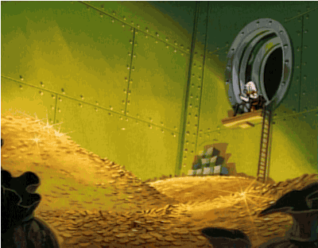

## Gegeven

Simon beslist de centen die hij verdiende met vakantiewerk op een spaarboekje te plaatsen. Hij zet een bedrag opzij en wil berekenen hoelang het duurt voordat hij **minstens € 2 000** heeft. Het spaarboekje werkt met een samengestelde interest, dit betekent dat de interest na een jaar op het spaarboekje bijgestort wordt en meetelt bij de berekening van de volgende interest.

{:data-caption="Samengestelde interest laat geld steeds meer aangroeien." width="300px"}

## Gevraagd

* Schrijf een programma dat vraagt naar het startbedrag en de jaarlijkse interest;
* Bereken en toon het **eindbedrag** en geef **alle tussentijdse bedragen** ook weer. **Rond af** op twee decimalen.

#### Voorbeeld

Stel dat Simon € 750,65 op het spaarboekje stort. Hij spaart bij een bank die een interest van 2,10% op jaarbasis verzekert. Dan verschijnt er:

```
Na 1 jaar staat er € 766.41 op de rekening.
Na 2 jaar staat er € 782.51 op de rekening.
Na 3 jaar staat er € 798.94 op de rekening.
Na 4 jaar staat er € 815.72 op de rekening.
Na 5 jaar staat er € 832.85 op de rekening.
```
