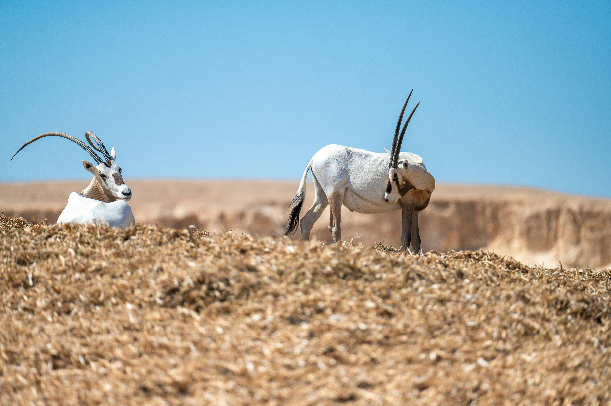

## Gegeven
Er is een reservaat met een kudde van een aantal antilopen. De kudde groeit elk jaar met ongeveer 6%.

{:data-caption="Foto door Gladimir Zuhovitsky op Unsplash." width="40%"}

## Gevraagd 
* Vraag aan de gebruiker hoeveel antilopen er dit jaar in de kudde zijn;
* Bepaal na hoeveel jaar er minstens 350 antilopen in de kudde zullen zijn;
* Toon de evolutie van de kudde elk jaar.

#### Voorbeeld

Stel dat er `120` antilopen in de kudde zijn, dan verschijnt er:

```
Jaar 1 : 127 antilopen
Jaar 2 : 134 antilopen
Jaar 3 : 142 antilopen
Jaar 4 : 150 antilopen
Jaar 5 : 159 antilopen
...
Jaar 15 : 278 antilopen
Jaar 16 : 294 antilopen
Jaar 17 : 311 antilopen
Jaar 18 : 329 antilopen
Jaar 19 : 348 antilopen
Jaar 20 : 368 antilopen
Er zullen minstens 350 antilopen zijn na 20 jaar.
```

{: .callout.callout-info}
>#### Tips
>* Gebruik een `while-lus` om elk jaar de grootte van de kudde te verhogen met 6%.
>* **Rond** het aantal antilopen dat elk jaar geboren wordt **af** **naar beneden**.
