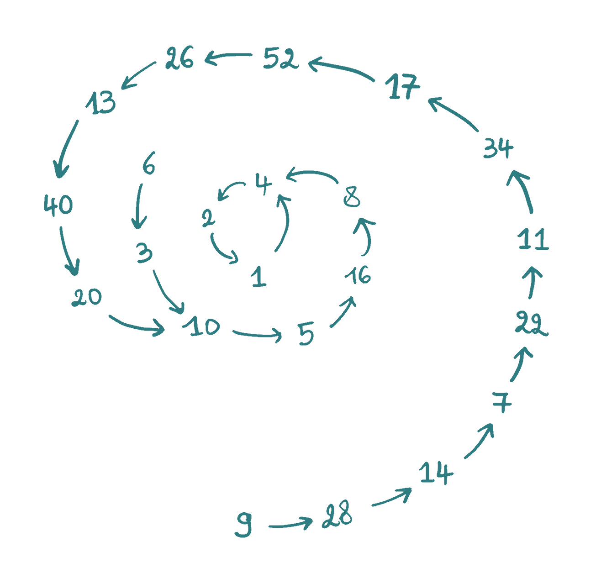

## Gegeven
Het vermoeden van Collatz is een vermoeden in de getaltheorie dat zegt dat een bepaalde iteratie in alle gevallen resulteert in het getal 1, om het even welk getal n als beginwaarde gekozen wordt.

De herhaling gaat als volgt:

- is het getal even, halveer het dan;
- is het getal oneven, neem dan het drievoud en tel er één bij op;

Op onderstaande afbeelding zie je dit proces uitgevoerd voor de startwaarde 9 en startwaarde 6. De herhalingen hebben een verschillende lengte, maar resulteren steeds in het getal 1.

{:data-caption="Een collatz-spiraal." width="40%"}

## Gevraagd

Schrijf een programma dat aan de gebruiker het startgetal vraagt en nadien telkens het volgende getal bepaalt. Elke waarde wordt op het scherm weergegeven en het programma stopt bij 1.

#### Voorbeelden

Bij invoer 6 verschijnt er:

``` 
6
3
10
5
16
8
4
2
1
``` 

{: .callout.callout-primary}
>#### Trivia
> Dit is een vermoeden of hypothese. Er is met andere woorden nog geen wiskundig bewijs voor gevonden. Het wiskundig genie <a href="https://nl.wikipedia.org/wiki/Paul_Erd%C5%91s" target="_blank">Paul Erdős</a> zei over deze hypothese: "De huidige wiskunde is nog niet klaar voor dergelijke problemen."

