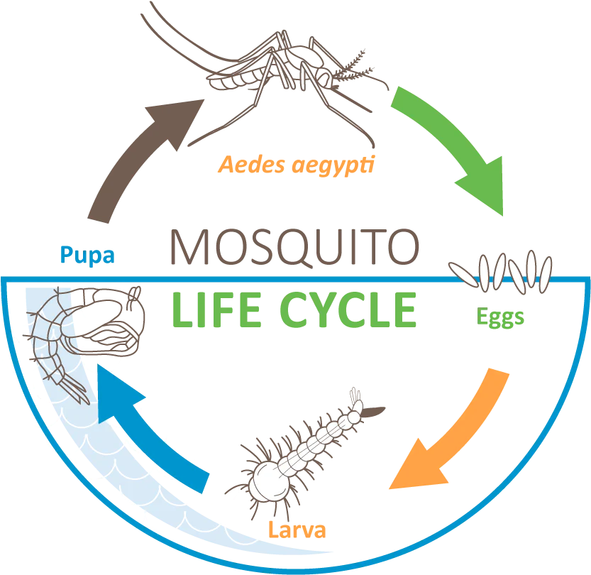

## Gegeven

Heb je je ooit afgevraagd waarom er zoveel muggen zijn in vochtige omgevingen? Eén reden is dat vrouwelijke muggen honderden eitjes kunnen leggen. Gelukkig overleven de meeste eitjes niet, maar men zegt dat een enkel paar muggen in enkele weken duizenden nakomelingen kan voortbrengen.

We gaan dit proces in detail bekijken. De levenscyclus van een mug bestaat uit vier stadia: eitje, larve, pop, en volwassen mug.

{:data-caption="Levenscyclus van een mug." width="35%"}

Om dit proces te simuleren, maken we een aantal vereenvoudigende veronderstellingen (die niet natuurgetrouw zijn). Zo gaan we ervan uit dat er geen natuurlijke vijanden zijn en de volwassen muggen niet sterven na een bepaalde periode.  Aan het einde van elke week vinden volgende transformaties plaats:

- Elke volwassen mug legt een **aantal eitjes** en sterft. Diezelfde dag komt uit elk eitje een larve,
- Sommige larven zijn niet sterk genoeg of worden opgegeten. Ongeveer **de helft van de larven** overleeft en zal gaan verpoppen,
- Uit ongeveer **twee derde van de poppen** komt een mug. De andere poppen drogen uit.

Bijvoorbeeld: 
* Zijn er **5 larven**, dan blijven er 2 over om te verpoppen *(hier zal je de gehele deling // moeten gebruiken)*.
* Zijn er 6 **larven**, dan blijven er 3 over.
* Zijn er 6 **poppen**, dan komen er daar 4 muggen uit. 

## Gevraagd

Schijf een programma dat:

- Aan de gebruiker, in deze volgorde, het `aantal muggen`, het `aantal larven` en het `aantal poppen` **vraagt**,
- Daarna **vraagt** `hoeveel eitjes` één volwassen mug legt,
- Tot slot het `aantal weken` dat je wil simuleren **vraagt.**

Het programma moet het aantal muggen aan het einde van het aantal weken berekenen en dit weergeven op het scherm.

#### Voorbeelden

Stel dat er `10` muggen, `40` larven en `20` poppen zijn in het begin. Vervolgens wordt ingetikt dat één mug telkens `8` eitjes legt en er in totaal `10` weken gesimuleerd worden.

Er verschijnt:
```
Er zijn 4218 muggen na week 10
```

Bij achtereenvolgende invoer `10`, `10`, `10` (muggen, larven en poppen) en daarna `2` (het aantal eitjes dat elke mug legt) en `6` (het aantal weken) verschijnt er:

```
Er zijn 63 muggen na week 6
```

{: .callout.callout-secondary}
>#### Bron
> CTU Open 2012, Tsjechië
