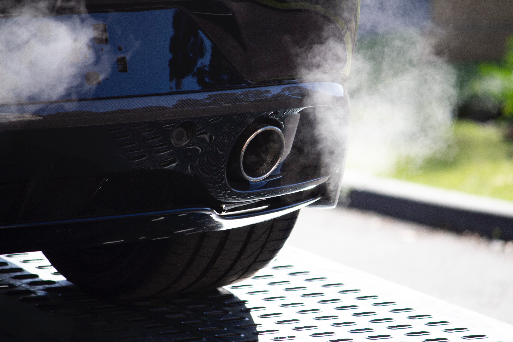

## Gegeven
Volgens <a href="https://www.vrt.be/vrtnws/nl/2022/03/10/zo-bespaar-je-met-je-gezin-autobrandstof-in-dure-tijden/" target="_blank">dit artikel</a> van VRT.NWS verbruikt een moderne dieselwagen zo'n 4,5 liter diesel per 100 km.

{:data-caption="De uitlaatgassen van een wagen." width="60%"}

## Gevraagd
Schrijf een programma dat een afstand in km vraagt en vervolgens berekent hoeveel brandstof een moderne dieselwagen gebruikt. Deze hoeveelheid wordt vervolgens op het scherm weergegeven, afgerond op **2 cijfers na de komma**.

#### Voorbeelden
De invoer `100.0` levert als uitvoer
```
4.5 liter
```

De invoer `150.0` levert als uitvoer
```
6.75 liter
```

De invoer `45.0` levert als uitvoer
```
2.02 liter
```