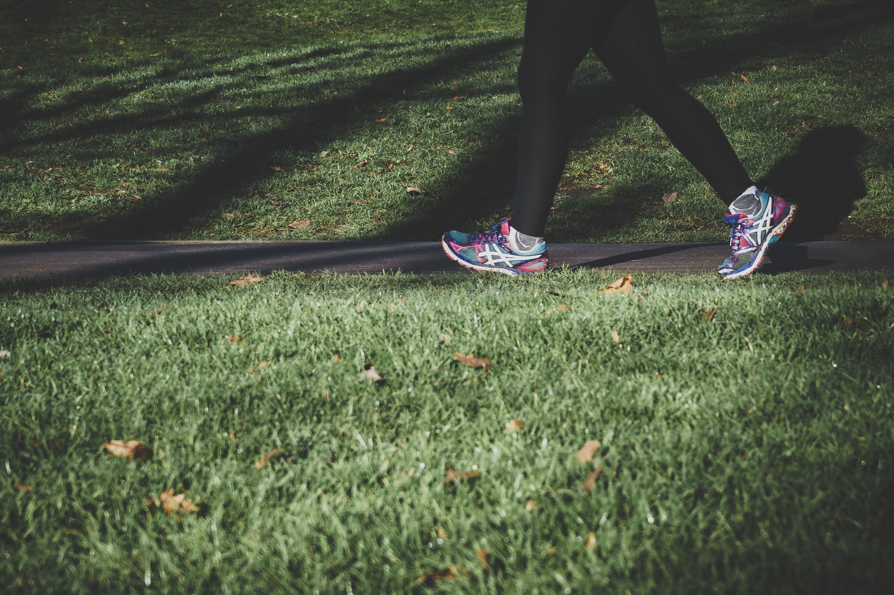

## Gegeven

Het Vlaams Instituut Gezond Leven lanceerde in 2022 de <a href="https://10000stappen.gezondleven.be/" target="_blank">campagne</a> "10.000 stappen: elke stap telt!"

{:data-caption="Stappen is gezond!" width="45%"}

## Gevraagd

Schrijf een programma dat vraagt hoeveel stappen je vandaag reeds gezet hebt en vervolgens berekent hoeveel stappen je nog moet zetten.

#### Voorbeelden
De invoer `5342` levert als uitvoer
```
Je dient nog 4658 stappen te zetten.
```

De invoer `9995` levert als uitvoer
```
Je dient nog 5 stappen te zetten.
```