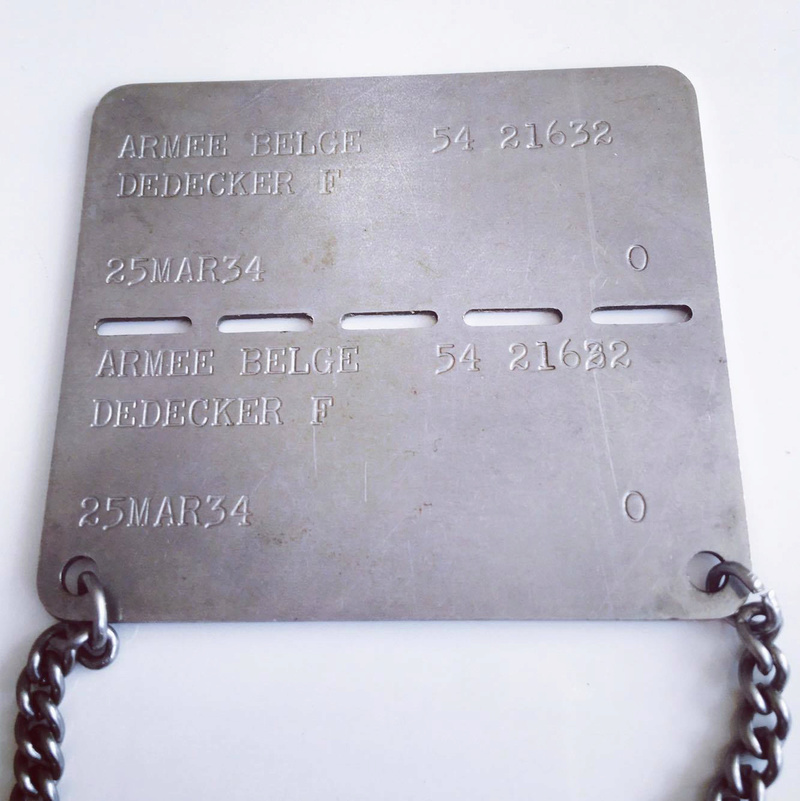

## Gegeven

Een identiteitsplaatje of ID-hanger is een plaatje van metaal zoals roestvast staal, waarin teksten gedrukt kunnen worden. Zo'n plaatje wordt vaak gebruikt in het leger. Indien een soldaat omkomt tijdens gevechten kan men die alsnog identificeren aan de hand van het plaatje.

{:data-caption="Identificatieplaatje uit het Belgisch leger." width="40%"}

Het identificatieplaatje in het Belgische leger is ontworpen om in twee stukken gebroken te kunnen worden bij een sterfgeval. Het bovenste stuk blijft bij het lichaam, terwijl het onderste deel naar het Belgisch leger gaat.

Tegenwoordig ziet het plaatje er uit als volgt:
- Op de eerste regel staat BELGISCH LEGER gevolgd door 3 spaties en de **geboortedatum**;
- Daarna de **naam** en **voornaam**
- Tot slot het **soldatennummer**, **bloedgroep** en **godsdienst**

## Gevraagd

- Vraag aan een gebruiker **in volgorde** naar de voornaam, naam, het soldatennummer, de geboortedatum, de bloedgroep en de godsdienst.
- Geef dit weer op het scherm zoals het hoort op zo'n Belgisch identificatieplaatje.

#### Voorbeeld

Bij de invoer:
```
Voer de voornaam in: Fernand
Voer de naam in: Dedecker
Voer het soldatennummer in: 21632
Voer de geboortedatum in: 25/03/1934
Voer de bloedgroep in: A+
Voer het geloof van de soldaat in: KAT
```

verschijnt er:
```
BELGISCH LEGER   25/03/1934
Dedecker Fernand
21632 A+ KAT
```