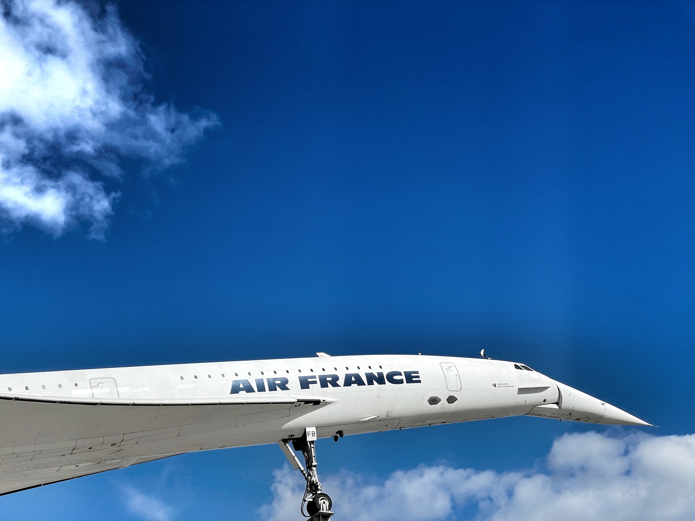

## Gegeven

De Concorde was een supersonisch passagiersvliegtuig, tot stand gekomen door een samenwerking tussen de Britse en Franse regeringen. Het vliegtuig vloog voor het eerst in 1969, het maakte zijn laatste vlucht op 26 november 2003.

{:data-caption="De neus van een Franse Concorde." width="40%"}

De *gemiddelde snelheid* van een Concorde ligt op 1 740 km/u.

## Gevraagd

- Vraag aan een gebruiker naar het aantal **minuten** dat hij of zij zal vliegen met de Concorde.
- Bereken daarna de **afstand** die de gebruiker heeft afgelegd.

#### Voorbeeld

Bij de invoer:
```
Hoeveel minuten zal je met de Concorde vliegen? 30
```

verschijnt er:
```
Als je 30 minuten vliegt, dan heb je 870.0 km afgelegd.
```