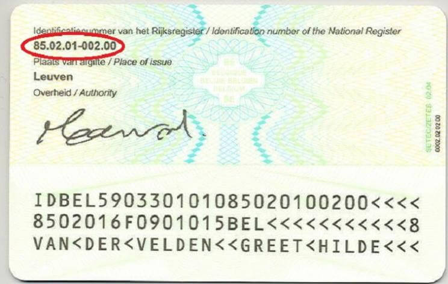

## Gegeven

Het rijksregisternummer is een uniek identificatienummer toegekend aan natuurlijke personen die ingeschreven zijn in België. Iedere burger met ofwel een Belgisch identiteitsdocument ofwel een Belgisch verblijfsdocument heeft een rijksregisternummer.

Het rijksregisternummer staat achteraan op de identiteitskaart. 

{:data-caption="Een voorbeeld van een rijksregisternummer." width="30%"}

Dit nummer bestaat uit elf cijfers, waarvan de eerste zes cijfers corresponderen met de **geboortedatum**, in de volgorde jaar, maand en dag. De volgende 5 cijfers bestaan uit de **dagteller** van het aantal geboortes die dag en daarna een **controlegetal**.

## Gevraagd

- **Vraag** een gebruiker **in volgorde** naar het jaartal, maand en dag van geboorte. Daarna naar de dagteller en tot slot naar het controlegetal.
- **Toon** vervolgens het rijksregisternummer op het scherm..

#### Voorbeeld

Bij de invoer:
```
Voer de laatste twee cijfers van je geboortejaar in: 85
Voer je geboortemaand in: 02
Voer je geboortedag in: 01
Voer de dagteller in: 002
Voer het controlegetal in: 00
```

verschijnt er:
```
Rijksregisternummer: 85.02.01-002.00
```