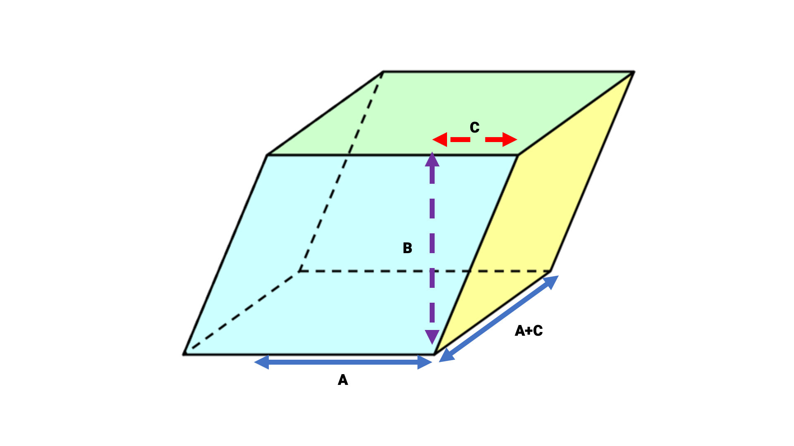

## Gegeven:
Een parallellepipedum (probeer dat maar eens driemaal na elkaar uit te spreken) is een ruimtefiguur waarvan elk zijvlak opgebouwd is uit een parallellogram. 
Via de figuur hieronder zie je drie gegeven afmetingen: A, B en C.

{:data-caption="De parallellepipedum met ABC-notaties" width="50%"}


## Gevraagd: 
* Schrijf een programma dat `vraagt` naar de lengte van A, B en C; 
* Bereken de **oppervlakte van één zijvlak**, `rond af` naar twee decimalen en `print` dit naar het scherm; 
* Bereken de **omtrek van één zijvlak**, `rond af` naar twee decimalen en `print` dit naar het scherm; 
* Bereken het **volume van de volledige figuur**, `rond af` naar twee decimalen en `print` dit naar het scherm; 


## Invoer: 
```
Voer de lengte in van A (in cm): 6.8
Voer de lengte in van B (in cm): 10.8
Voer de lengte in van C (in cm): 2.54 
```

## Uitvoer: 

Rond de `oppervlakte`, `omtrek`, en `volume` af tot **twee decimalen**. 
```
De oppervlakte van één zijvlak bedraagt ... vierkante cm.
De omtrek van één zijvlak bedraagt ... cm. 
Het volume van de parallellepipedum bedraagt ... kubieke cm. 
```

{: .callout.callout-info}
>#### Tips
> * Start jouw algoritme met een `import math`.
> * Je zal de **stelling van Pythagoras** moeten gebruiken.  
> * De formule voor dit volume is dezelfde als deze voor een balk. 


