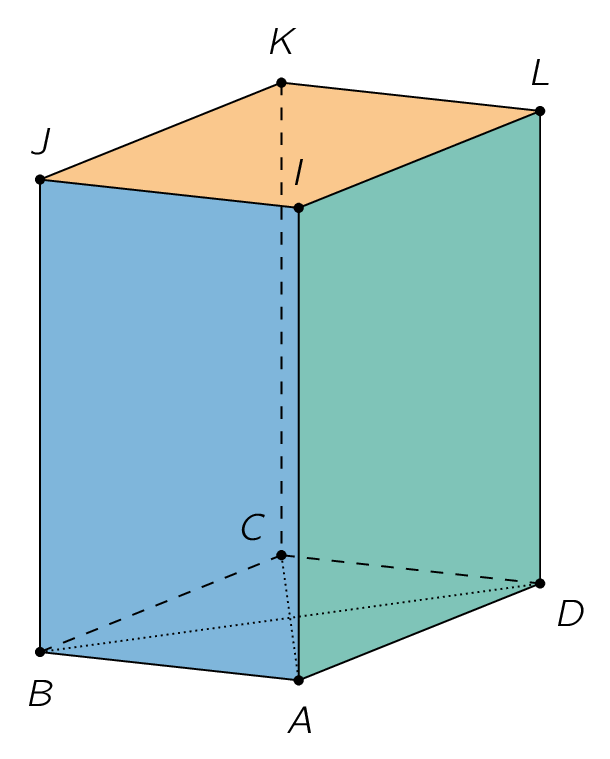

## Gevraagd
Schrijf een programma waarbij je de lengte van de *diagonalen* vraagt van onderstaand (recht) prisma met een **ruit** als **grondvlak**. Vraag **nadien** naar de *hoogte* van het prisma.

{:data-caption="Een prisma." .light-only width="25%"}

{:data-caption="Een prisma." .dark-only width="25%"}

Bereken daarna het **volume** en de **oppervlakte** van de prisma. Rond het volume af op 2 decimalen en de oppervlakte op 3 decimalen.

#### Voorbeeld

Voor een prisma met |AC| = 4,4 cm, |BD| = 8,6 cm en |AI| = 5,0 cm verschijnt er:
```
Het prisma heeft een volume van 94.6 cm³.
Het prisma heeft een oppervlakte van 134.442 cm².
```

{: .callout.callout-info}
>#### Tips
> - De diagonalen van een ruit snijden elkaar loodrecht en middendoor.
> - Je zal de **stelling van Pythagoras** nodig hebben.
