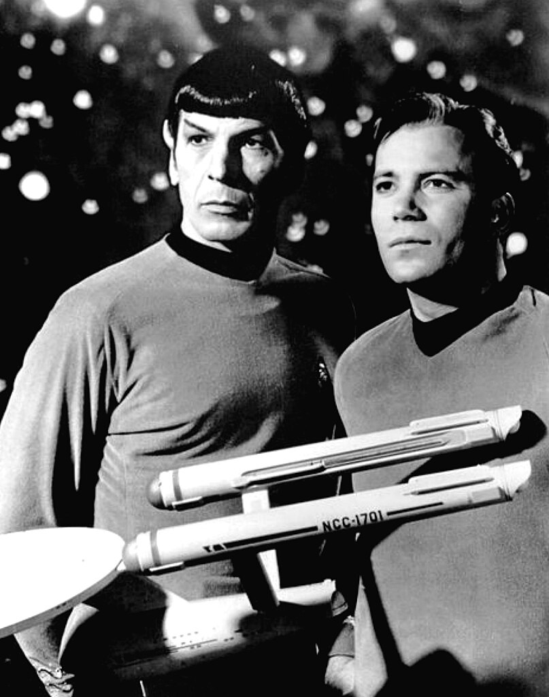

## Gegeven
<a href="https://nl.wikipedia.org/wiki/Star_Trek_(de_oorspronkelijke_serie)" target="_blank">Star Trek</a> is een populaire sciencefictiontelevisieserie die in de jaren 70 uitgezonden werd op televisie. Er kwamen heel wat spinoffs en nog steeds worden nieuwe afleveringen gemaakt. De serie is over de jaren heen geëvolueerd naar een cultfenomeen.

{:data-caption="Kirk en Spock met op de voorgrond de Enterprise" width="35%"}

De serie speelt zich af in de 23e en 24e eeuw en gebruikt een alternatief **datumsysteem**. Men spreekt er bijvoorbeeld over "Stardate 6609.08", een datum die in onze kalender overeenkomst met 8 september 1966. Men creëert de stardates door van het jaartal 1900 af te trekken (in dit geval dus 66) en hier de maand en dag aan vast te plakken.

"Stardate 10105.11" komt bijvoorbeeld overeen met 11 mei 2001 want het verschil van 2001 en 1900 is 101, het maandnummer is 05 en de dag is 11.

## Gevraagd
Schrijf een programma dat de stardate vraagt en vervolgens dit in onze huidige kalendervorm weergeeft.

#### Voorbeelden
Indien de invoer `6609.08` is, verschijnt er:
```
Dit komt overeen met 8-9-1966.
```

Indien de invoer `10105.11` is, verschijnt er:
```
Dit komt overeen met 11-5-2001.
```

{: .callout.callout-info}
>#### Tips
> - Kommagetallen zoals `11.0` omvormen naar `11` doe je via `int()`.
> - Gebruik de functie `str( 11 )` om het getal `11` om te vormen naar tekst zodat je kunt concateneren met `+`.

