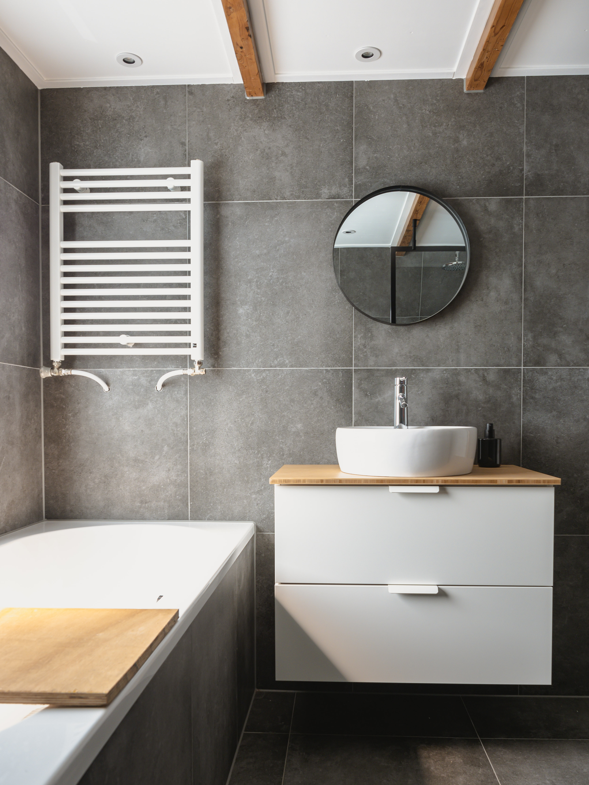

## Gegeven
Het interieurarchitectenbureau Bokko wil graag een programma waarmee je het aantal tegels berekent dat je nodig hebt voor rechthoekige muren.

{:data-caption="Tegels in een badkamer." width="40%"}

Het aantal **vierkante** tegels wordt per muur berekend. Voor ieder stukje tegel moet je 1 tegel aanrekenen. Heb je bijvoorbeeld voor de hoogte 7 tegels en een stukje nodig, dan moet je 8 tegels aankopen. **Je gooit dus mogelijks een deeltje weg.**. Hetzelfde geldt voor de breedte. 

Sommige tegels zijn reeds stuk in de verpakking. Reken nog 7% extra tegels om dit op te vangen.


## Gevraagd
- Vraag naar de hoogte en de breedte van de muur **in m**.
- Vraag naar zijde van de **vierkante** tegel **in cm**.
- Vraag naar tegelsoort.
- Bereken het **aantal tegels** dat je moet aankopen.

#### Voorbeelden
Is de muur `2.1` m hoog en `3.2` m breed en wil je `marmeren` tegels aankopen met een zijde van `20` cm, dan verschijnt er:
```
U heeft 189 marmeren tegels nodig voor een muur van 2.1 x 3.2 m.
```
