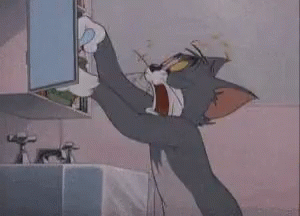

## Gegeven
Heb je je dagelijkse medicatie al genomen en hoeveel medicatie heb je nog liggen?

{:data-caption="Animatie uit Tom & Jerry." width="300px"}

## Gevraagd
Maak een programma dat voor een gebruiker berekent hoe lang deze nog verder kan met de beschikbare medicatie.

Vraag naar het aantal pillen in een doosjes en daarna naar het aantal pillen dat je per dag neemt. Bereken vervolgens het aantal dagen dat je nog verder kan en de overschot. Geef dit weer op het scherm.

#### Voorbeelden
Indien je dagelijks `3` pillen moet nemen en er zitten er `20` in een doosje, dan verschijnt er:

```
U komt 6 dag(en) toe.
U heeft 2 pil(len) over.
```
