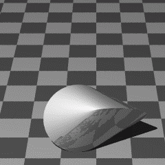

## Gegeven
Een oloïde is een geometrisch lichaam, opgebouwd uit twee cirkels, dat uitgevonden werd door de wiskundige en kunstenaar Paul Schatz. Kenmerkend is dat dit lichaam een tuimelende beweging maakt indien deze over een tafelblad rolt. Dit 'rollen' blijkt uitermate geschikt voor het mengen van vloeistoffen.

{:data-caption="Een rollende oloïde." width="240px"}

Bij het rollen is het verschil tussen het hoogste en laagste punt $$\mathsf{\Delta h}$$ van de oloïde te berekenen via onderstaande formule:

$$
\mathsf{ \Delta h = r \cdot \left( \dfrac{\sqrt{2}}{2} - 3\dfrac{\sqrt{3}}{8} \right) }
$$

waarbij $$\mathsf{r}$$ de straal van zo'n cirkel is waaruit deze werd opgebouwd.

## Gevraagd
Maak een programma dat de gebruiker vraagt naar de straal van zo'n cirkel vraagt (in cm) en nadien het hoogteverschil uitrekent. Rond af op twee decimalen.

#### Voorbeelden
Indien de straal `3.2` cm meet, dan verschijnt er:

```
Het hoogteverschil is 0.18 cm.
```
