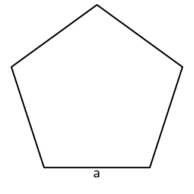
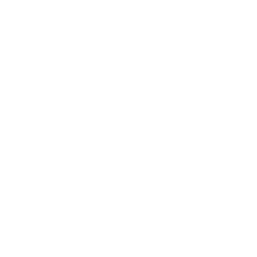

## Gegeven
Voor elke regelmatige vijfhoek met zijde $$\mathsf{a}$$ kan men een omgeschreven en ingeschreven cirkel construeren. In onderstaande animatie zie je dit stap per stap gebeuren.

{:data-caption="Omgeschreven en ingeschreven cirkel van een regelmatige vijfhoek" .light-only width="30%"}

{:data-caption="Omgeschreven en ingeschreven cirkel van een regelmatige vijfhoek" .dark-only width="30%"}

De straal van de <span style="color:#FF8E27">omgeschreven (grootste) cirkel</a> $$\mathsf{R}$$ en van de <span style="color:#086FBD">ingeschreven (kleinste) cirkel</a> $$\mathsf{r}$$ kan men berekenen via de formules:

$$
 \mathsf{R = \dfrac{a}{10} \cdot \sqrt{50+10\sqrt{5}} \qquad \text{en}\qquad r = \dfrac{a}{10}\cdot \sqrt{25+10\sqrt{5}}}
$$

## Gevraagd
Schrijf een programma dat de zijde van een regelmatige vijfhoek, $$\mathsf{a}$$, in cm vraagt en vervolgens de oppervlakte van het gebied tussen de omgeschreven en ingeschreven cirkel berekent. **Rond** hierbij **af** op 2 decimalen.

#### Voorbeeld
Meet de zijde `3.0` cm, dan verschijnt:
```
De oppervlakte bedraagt 7.07 cm².
```
