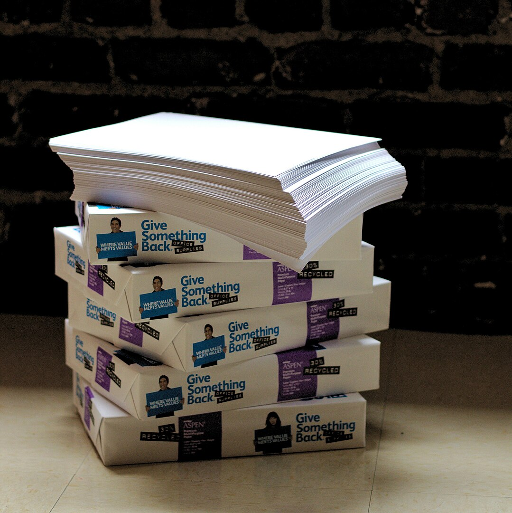

## Gegeven

Een papierformaat beschrijft de afmetingen van een vel papier. Er zijn verschillende standaarden voor de formaten van papier, zo gebruikt men in België meestal de <a href="https://nl.wikipedia.org/wiki/Papierformaat#De_A-standaard" target="_blank">A standaard</a>. Toetsen worden bijvoorbeeld afgedrukt op het **A4 formaat**. Er zijn echter ook andere standaarden, zo bestaat ook de B, C en D standaarden.

{:data-caption="Foto door Sage Ross op Wikimedia Commons." width="35%"}

## Gevraagd

- Vraag aan een gebruiker welke standaard hij gebruikt;
- Vraag vervolgens het kenmerkend getal dat bij deze standaard hoort;
- Vraag tot slot de lengte **en** breedte in millimeter;
- Geef deze informatie vervolgens weer in een overzichtelijke zin.

#### Voorbeeld

Bij de invoer:
```
Voer de standaard in: A
Voer het getal in: 4
Voer de lengte in (in mm): 297
Voer de breedte in (in mm): 210
```

verschijnt er:
```
Een A4 blad heeft als afmetingen 210 mm x 297 mm.
```