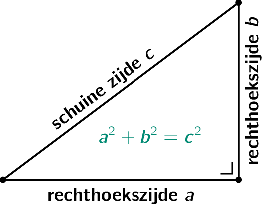
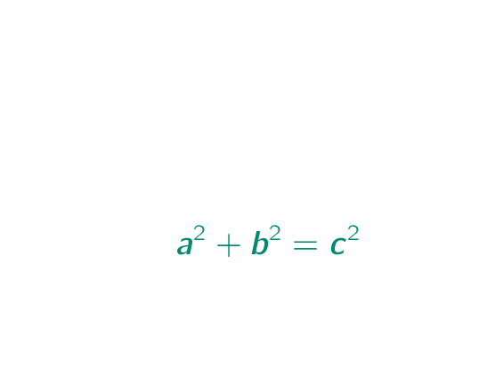

Robbe installeert een nieuwe bureau in zijn werkkamer. Hij moet hierbij de lengte van een schuine zijde van een rechthoekige driehoek berekenen. 

Gelukkig kan dit eenvoudig met behulp van **de stelling van Pythagoras**:

{: .callout.callout-success}
>#### Stelling van Pythagoras
> In een rechthoekige driehoek is de som van de kwadraten van de rechthoekszijden gelijk aan het kwadraat van de schuine zijde.

Hieronder zie je een figuur die stelling beter illustreert, er geldt in deze figuur dus $$\mathsf{a^2+b^2 = c^2}$$.

{:data-caption="De stelling van Pythagoras." .light-only width="30%"}

{:data-caption="De stelling van Pythagoras." .dark-only width="30%"}


## Gevraagd
- Bereken de **lengte van de schuine zijde** (c) met behulp van de stelling van Pythagoras;
- Geef de berekende lengte weer op het scherm in de volgende vorm: 

```
De lengte van de schuine zijde is ... cm.
```

**Rond** hierbij **af** op 2 cijfers na de komma.

#### Voorbeeld

Voor een driehoek met rechthoekszijden `137.11` en `66.78` cm verschijnt er:

```
De lengte van de schuine zijde [c] is 152.51 cm.
```

{: .callout.callout-info}
>#### Tips
> - Vergeet niet om de invoer om te zetten naar het juiste datatype;
> - Gebruik `math.sqrt()` om de wortel van een getal te berekenen.
