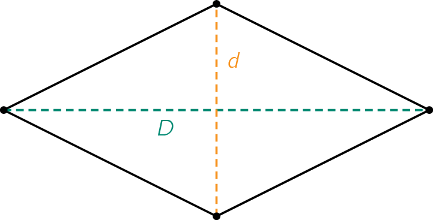
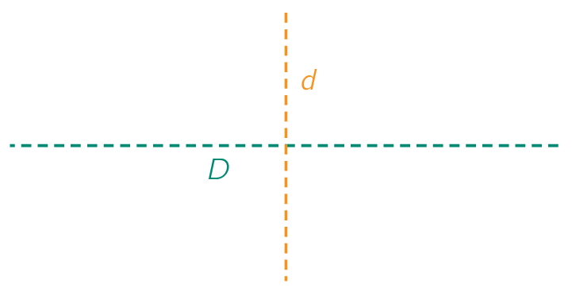

## Gegeven

Een **ruit** met een grote diagonaal (D) en kleine diagonaal (d).

{:data-caption="Een ruit." .light-only width="30%"}

{:data-caption="Een ruit." .dark-only width="30%"}


## Gevraagd

- Bereken de omtrek en oppervlakte van de ruit;
- Rond de resultaten af naar **twee decimalen**; 
- Geef deze omtrek en oppervlakte weer op het scherm.

#### Voorbeeld

Bij een ruit met diagonalen `8` en `6` cm verschijnt er:

```
De omtrek van de ruit is 20.0 cm.
De oppervlakte van de ruit is 24.0 cm².
```

{: .callout.callout-info}
>#### Tips
> - Vergeet niet om de input om te zetten naar een `float` of `int`;
> - Gebruik **de stelling van Pythagoras** in een **rechthoekige** driehoek (`a² + b² = c²`) om de omtrek te berekenen.
