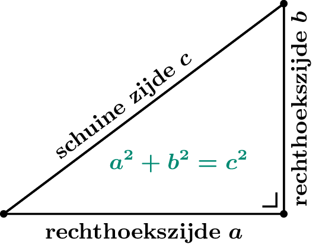

Robbe installeert een nieuwe bureau in zijn werkkamer. Hij moet hierbij de lengte van een schuine zijde van een rechthoekige driehoek berekenen. 

Gelukkig kan dit eenvoudig met behulp van **de stelling van Pythagoras**:

{: .callout.callout-success}
>#### Stelling van Pythagoras
> In een rechthoekige driehoek is de som van de kwadraten van de rechthoekszijden gelijk aan het kwadraat van de schuine zijde.

Hieronder zie je een figuur die stelling beter illustreert.

{:data-caption="De stelling van Pythagoras." .light-only width="30%"}

{:data-caption="De stelling van Pythagoras." .dark-only width="30%"}


## Gevraagd
- Bereken de **lengte van de schuine zijde** (c) met behulp van de stelling van Pythagoras;
- Geef de berekende lengte weer op het scherm in de volgende vorm: 

```
De lengte van de schuine zijde is ... cm.
```

## Invoer
Mogelijk invoer kan zijn:

```
De lengte van zijde [a] is: 137.11
De lengte van zijde [b] is: 66.78
```

## Uitvoer
```
De lengte van de schuine zijde [c] is ... cm.
```

{: .callout.callout-info}
>#### Tips
> - Vergeet niet om de invoer om te zetten naar het juiste datatype;
> - Gebruik `math.sqrt()` om de wortel van een getal te berekenen.
