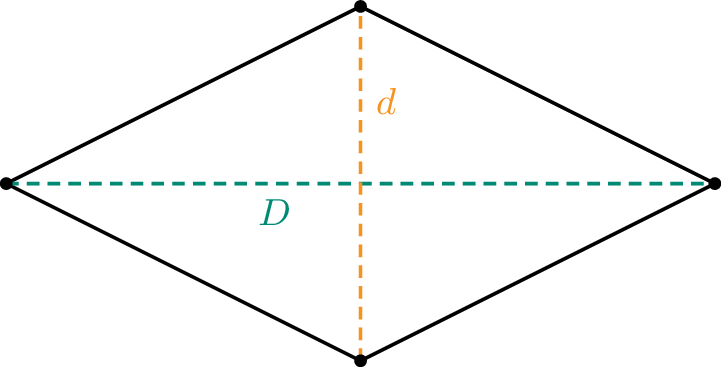
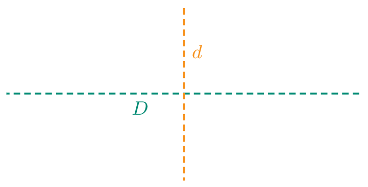

## Gegeven

Een **ruit** met een grote $$D$$ en kleine $$d$$ diagonaal.

{:data-caption="Een ruit." .light-only width="30%"}

{:data-caption="Een ruit." .dark-only width="30%"}


## Gevraagd

- Bereken de omtrek en oppervlakte van de ruit;
- Rond de resultaten af naar **twee decimalen**; 
- Geef deze omtrek en oppervlakte weer op het scherm.

## Invoer
Een mogelijk voorbeeld is:
```
Voer de lengte van de grote diagonaal in (in cm): 8
Voer de lengte van de kleine diagonaal in (in cm): 6
```

## Uitvoer
```
De omtrek van de ruit is ... cm.
De oppervlakte van de ruit is ... cm².
```

{: .callout.callout-info}
>#### Tips
> - Vergeet niet om de input om te zetten naar een `float` of `int`;
> - Gebruik **de stelling van Pythagoras** `a² + b² = c²` om de omtrek te berekenen.
