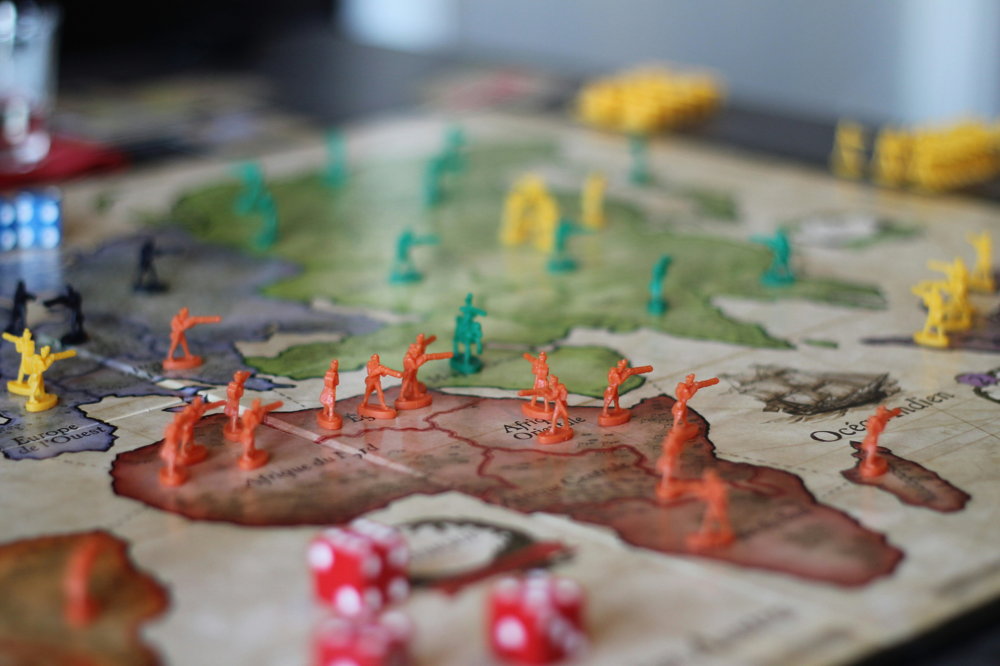

## Gegeven

<a href="https://nl.wikipedia.org/wiki/Risk_(bordspel)">Risk</a> is een klassiek bordspel waarbij het (meestal) de bedoeling is dat je de ganse wereldkaart gaat veroveren. Elk gebied dat je bezet geeft je per beurt een aantal legers die je kan gebruiken om een tegenstander aan te vallen.

{:data-caption="Een spelletje Risk." width="40%"}

Bij het aanvallen is het steeds zo dat de aanvaller met drie rode dobbelstenen gooit en de verdediger met slechts twee blauwe dobbelstenen mag gooien. Daarna wordt het aantal ogen gerangschikt van hoog naar laag en als de aanvaller bij zijn twee hoogste waarden telkens hoger scoort dan de twee hoogste waarden van de verdediger, dan worden twee legers vernietigt.

Een voorbeeld ter verduidelijking.

Als de aanvaller de volgende dobbelstenen gooit:

  
 

## Gevraagd

#### Voorbeeld

d