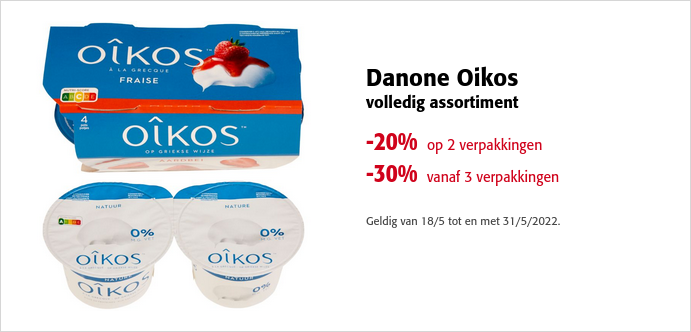

Op de website van de Colruyt vinden we onderstaande promo voor één **verpakking** met 4 porties aardbeienyoghurt van €3,29.

{:data-caption="Korting op de yoghurt." width="450px"}

## Opgave
Schrijf een programma dat het aantal **verpakkingen** vraagt en vervolgens totale kostprijs **afdrukt**. 
De totale kostprijs wordt afgerond op 2 cijfers na de komma.

#### Voorbeelden
Bij de aankoop van één verpakking verschijnt er:
```
De kostprijs is 3.29 euro.
```

Bij de aankoop van twee verpakkingen verschijnt er:
```
De kostprijs is 5.26 euro.
```

Bij de aankoop van drie verpakkingen verschijnt er:
```
De kostprijs is 6.91 euro.
```
